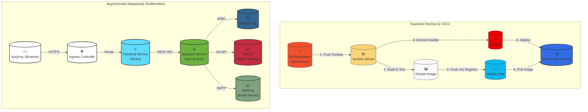

# Freelance Project - Εργασία DevOps

Καλωσορίσατε στο αποθετήριο της εργασίας μας για το μάθημα **"Βασικές έννοιες και εργαλεία DevOps"**. Το project αυτό είναι μια full-stack πλατφόρμα που φέρνει σε επαφή πελάτες με ελεύθερους επαγγελματίες (freelancers) για την υλοποίηση έργων πληροφορικής.

Η εφαρμογή αναπτύχθηκε αρχικά στα πλαίσια του μαθήματος "Κατανεμημένα Συστήματα" και, για τις ανάγκες του τρέχοντος μαθήματος, επεκτάθηκε με ένα πλήρες CI/CD pipeline και διαδικασίες αυτοματοποιημένου deployment σε πολλαπλά περιβάλλοντα (VMs, Docker, Kubernetes).

### Ομάδα 49
*   **Κωνσταντίνος Παπαδόγιαννης** - ΑΜ: 2022141
*   **Anastasiia Zervas** - ΑΜ: 2022119

---

## 🏛️ Αρχιτεκτονική Συστήματος

Το παρακάτω διάγραμμα απεικονίζει τη συνολική αρχιτεκτονική της λύσης μας. Διακρίνεται το CI/CD pipeline που αναλαμβάνει την αυτοματοποίηση της διαδικασίας build-test-deploy, καθώς και η αρχιτεκτονική της εφαρμογής όπως αυτή εκτελείται μέσα σε ένα Kubernetes cluster.



---

## 🛠️ Τεχνολογίες & Εργαλεία (Technology Stack)

Για την υλοποίηση του project χρησιμοποιήθηκε ένα εύρος σύγχρονων τεχνολογιών και εργαλείων που καλύπτουν όλο τον κύκλο ζωής της εφαρμογής.

| Τομέας | Τεχνολογία |
| :--- | :--- |
| **Backend** | `Java 21`, `Spring Boot 3`, `Spring Security (JWT)`, `Spring Data JPA`, `Maven` |
| **Frontend** | `React 19`, `Redux Toolkit`, `React Router`, `Axios`, `Tailwind CSS`, `npm` |
| **Βάση Δεδομένων** | `PostgreSQL` |
| **CI/CD** | `Jenkins` |
| **Αυτοματοποίηση** | `Ansible` |
| **Containerization** | `Docker`, `Docker Compose` |
| **Orchestration** | `Kubernetes (Minikube)`, `Ingress` |
| **Object Storage** | `MinIO` |
| **Email Testing** | `MailHog` |

---

## 🚀 Οδηγίες Εγκατάστασης (Getting Started)

Για την επίδειξη της εφαρμογής, το προτεινόμενο περιβάλλον είναι το **Kubernetes** καθώς αναδεικνύει το σύνολο της αρχιτεκτονικής μας.

### Προαπαιτούμενα
Βεβαιωθείτε ότι έχετε εγκατεστημένα τα παρακάτω εργαλεία:
*   [Docker](https://docs.docker.com/get-docker/)
*   [Minikube](https://minikube.sigs.k8s.io/docs/start/)
*   [kubectl](https://kubernetes.io/docs/tasks/tools/install-kubectl/)
*   [Ansible](https://docs.ansible.com/ansible/latest/installation_guide/intro_installation.html)

### Βήματα Deployment
1.  **Εκκίνηση του Minikube & Ingress:**
    ```bash
    minikube start --driver=docker
    minikube addons enable ingress
    ```
2.  **Κλωνοποίηση του Αποθετηρίου:**
    ```bash
    git clone <URL_του_repository>
    cd <repo_folder>
    ```
3.  **Εκτέλεση του Ansible Playbook:**
    Το παρακάτω playbook θα αναλάβει να κάνει deploy όλα τα components (Frontend, Backend, PostgreSQL, MinIO, MailHog) στο cluster του Minikube.
    ```bash
    ansible-playbook -i ansible/inventory.yml ansible/deploy-k8s-full.yml
    ```
4.  **Ενημέρωση του `/etc/hosts`:**
    Για να μπορέσουμε να έχουμε πρόσβαση στην εφαρμογή μέσω ενός FQDN (Fully Qualified Domain Name), προσθέτουμε την παρακάτω εγγραφή στο τοπικό μας αρχείο hosts.
    ```bash
    echo "$(minikube ip) freelance.local" | sudo tee -a /etc/hosts
    ```
5.  **Εκκίνηση του Tunnel & Πρόσβαση:**
    Ανοίξτε ένα **νέο terminal** και εκτελέστε την παρακάτω εντολή για να δρομολογήσετε το traffic από το local host στο cluster.
    ```bash
    minikube tunnel
    ```
    Αφήστε το terminal ανοιχτό. Τώρα μπορείτε να επισκεφθείτε την εφαρμογή από τον browser σας στη διεύθυνση:
    **[http://freelance.local](http://freelance.local)**

---

## 📂 Δομή του Project

Το project ακολουθεί μια **monorepo** δομή, όπου όλος ο κώδικας και τα αρχεία παραμετροποίησης συνυπάρχουν σε ένα κεντρικό αποθετήριο.

*   `src/`: Περιέχει τον πηγαίο κώδικα της **Backend** εφαρμογής (Spring Boot).
*   `frontend/`: Περιέχει τον πηγαίο κώδικα της **Frontend** εφαρμογής (React).
*   `ansible/`: Περιέχει τα **Ansible playbooks** για την αυτοματοποίηση του deployment.
*   `kubernetes/`: Περιέχει τα **Kubernetes manifest files** (Deployments, Services, Ingress κ.λπ.).
*   `docker/`: Περιέχει τα **Dockerfiles** για τη δημιουργία των images και το `docker-compose.yml` για τοπική ανάπτυξη.
*   `jenkins/`: Περιέχει τα **Jenkinsfiles** που ορίζουν τα CI/CD pipelines.
*   `docs/`: Περιέχει επιπλέον αρχεία τεκμηρίωσης.

---
Ευχαριστούμε για τον χρόνο σας! 