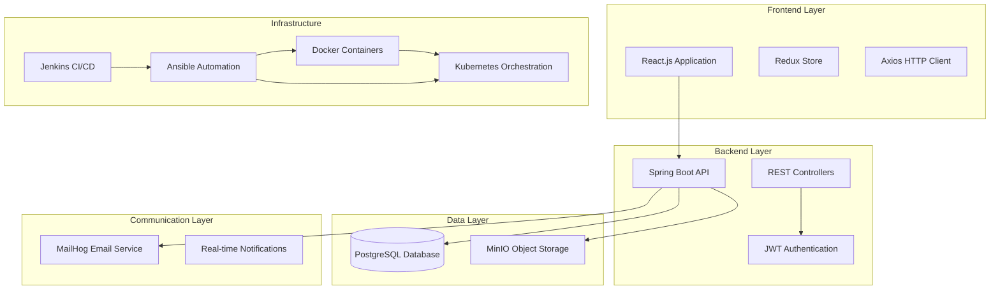
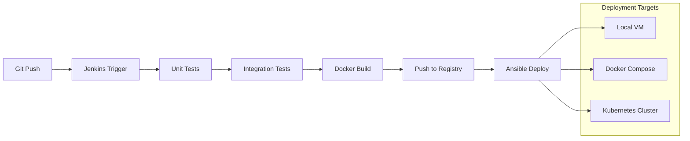
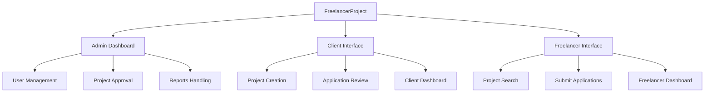
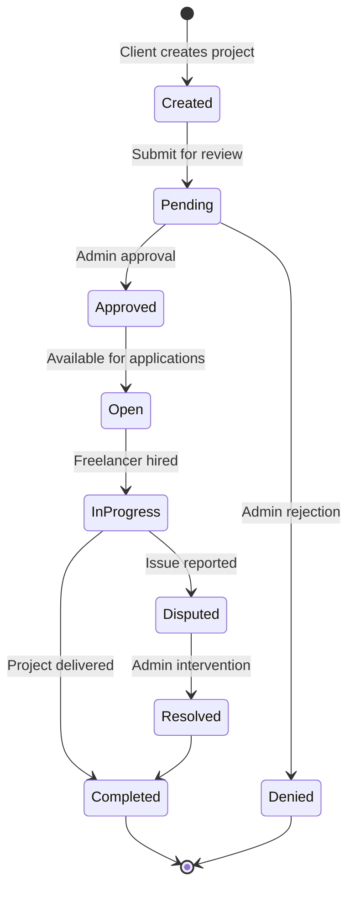
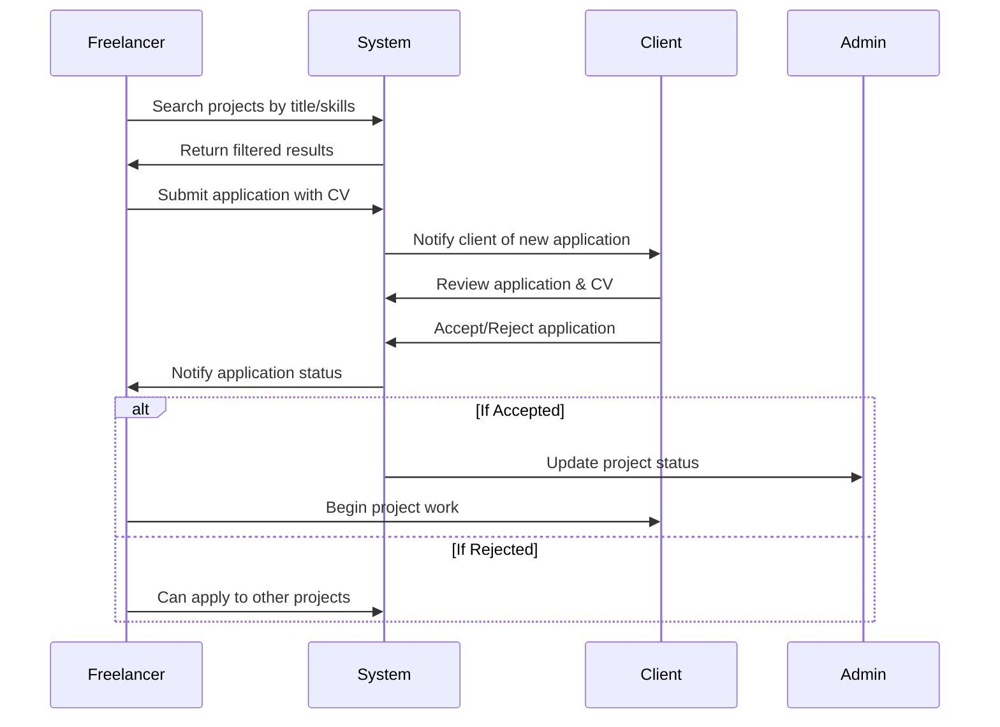
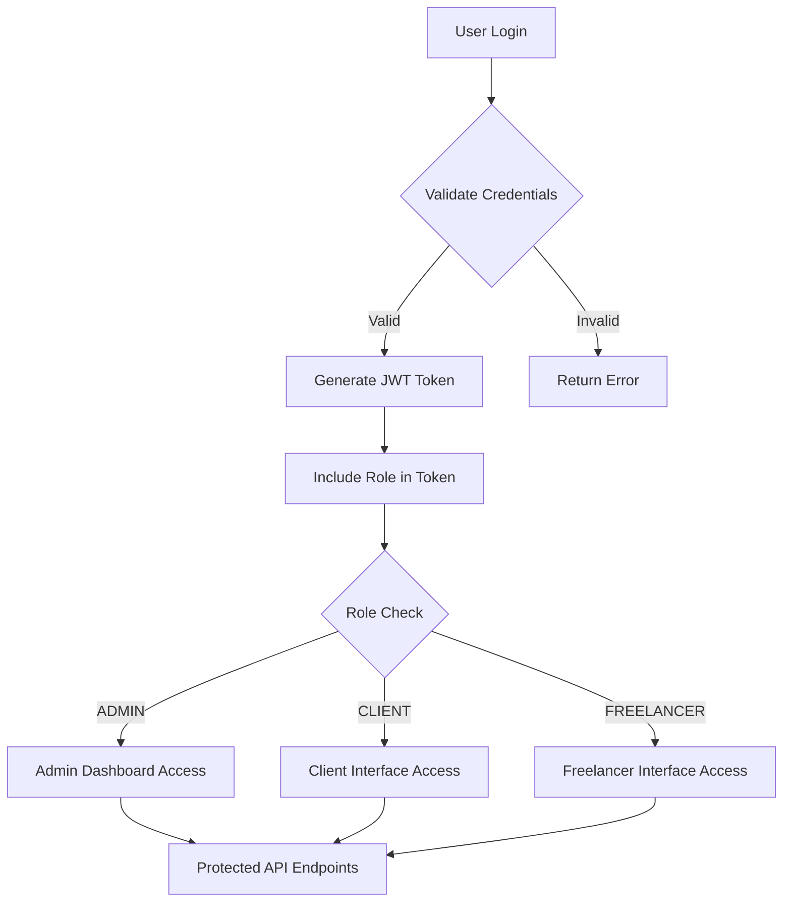
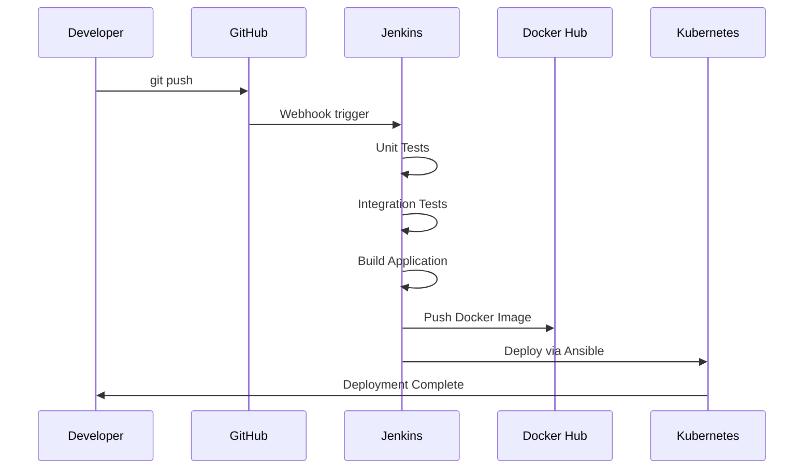

# FreelancerProject - DevOps Implementation

> **Ομάδα 49** | Μάθημα: Βασικές έννοιες και εργαλεία DevOps  
> **Κωνσταντίνος Παπαδόγιαννης** - ΑΜ 2022141  
> **Anastasiia Zervas** - ΑΜ 2022119

## 📋 Περιγραφή Έργου

Υλοποιήσαμε μια πλήρη **Freelance Platform** που συνδέει freelancers με πελάτες για έργα πληροφορικής. Η πλατφόρμα καλύπτει όλες τις απαιτήσεις της εκφώνησης DevOps, αποτελείται από πέντε βασικά συστατικά και υποστηρίζει deployment σε τρία διαφορετικά περιβάλλοντα με πλήρη αυτοματοποίηση.

### 💡 Concept και Λειτουργικότητα

Η FreelancerProject είναι μια **marketplace πλατφόρμα** που επιλύει το πρόβλημα σύνδεσης freelancers με πελάτες στον χώρο της πληροφορικής. Παρέχει:

- **Διαχείριση Έργων**: Δημοσίευση, αναζήτηση και διαχείριση έργων
- **Σύστημα Αιτήσεων**: Υποβολή και αξιολόγηση προτάσεων από freelancers
- **Role-based Authentication**: Διαφορετικά περιβάλλοντα για κάθε ρόλο
- **Real-time Επικοινωνία**: Chat σύστημα μεταξύ χρηστών
- **Διαχείριση Αρχείων**: Upload CV και εγγράφων έργων
- **Email Notifications**: Αυτόματες ειδοποιήσεις για events
- **Admin Oversight**: Εποπτεία και έγκριση έργων/χρηστών

## 🏗️ Αρχιτεκτονική Συστήματος



## 🎯 Συμμόρφωση με Εκφώνηση DevOps

### ✅ Απαιτούμενα Συστατικά (5/4 - Bonus!)

1. **Βάση Δεδομένων**: PostgreSQL με πλήρη schema
2. **Σύστημα Διαχείρισης Χρηστών**: Admin Dashboard με role-based access
3. **Βασικό Πληροφοριακό Σύστημα**: FreelancerProject (προσαρμογή από Κατανεμημένα)
4. **Σύστημα Email**: MailHog για testing + Gmail SMTP για production
5. **Σύστημα Αποθήκευσης**: MinIO για CV files και documents

### 🚀 DevOps Pipeline



## 🛠️ Τεχνολογίες και Εργαλεία

| Κατηγορία | Τεχνολογία | Χρήση |
|-----------|------------|--------|
| **Frontend** | React 18.2.0, Redux, TailwindCSS | User Interface & State Management |
| **Backend** | Spring Boot 3.4.1, Java 21 | REST API & Business Logic |
| **Database** | PostgreSQL, HikariCP | Data Persistence & Connection Pooling |
| **Storage** | MinIO | Object Storage για αρχεία |
| **Email** | MailHog, Gmail SMTP | Email notifications |
| **Containerization** | Docker, Docker Compose | Application packaging |
| **Orchestration** | Kubernetes, minikube | Container orchestration |
| **Automation** | Ansible | Infrastructure as Code |
| **CI/CD** | Jenkins | Continuous Integration/Deployment |

## 📁 Δομή Repository

```
FreelancerProject/
├── 📁 frontend/              # React.js Application
├── 📁 src/                   # Spring Boot Backend
├── 📁 docker/                # Docker configurations
├── 📁 kubernetes/            # K8s manifests
├── 📁 ansible/               # Automation playbooks
├── 📁 jenkins/               # CI/CD pipelines
├── 📁 docs/                  # Τεκμηρίωση
└── 📄 README.md              # Αυτό το αρχείο
```

## 🚀 Quick Start Guide

### Προαπαιτούμενα
```bash
# Εγκατάσταση βασικών εργαλείων
brew install docker kubernetes-cli ansible minikube
npm install -g npm@latest
java --version  # Απαιτείται Java 21
```

### Άμεση Εκτέλεση με Docker Compose
```bash
# Clone του repository
git clone https://github.com/naasssssty/Freelance.git
cd Freelance

# Εκκίνηση όλων των services
docker-compose -f docker/docker-compose.yml up -d

# Πρόσβαση στην εφαρμογή
open http://localhost:3000
```

### Kubernetes Deployment
```bash
# Εκκίνηση minikube
minikube start --driver=docker
minikube addons enable ingress

# Deploy με Ansible
cd ansible
ansible-playbook -i inventory.yml deploy-kubernetes.yml

# Πρόσβαση μέσω ingress
minikube tunnel
echo "127.0.0.1 freelance.local" | sudo tee -a /etc/hosts
open http://freelance.local
```

## 🎭 Ρόλοι Χρηστών και Λειτουργικότητα



### 👨‍💼 Admin (Διαχειριστής)
Ο διαχειριστής έχει πλήρη εποπτεία της πλατφόρμας και είναι υπεύθυνος για:
- **Έγκριση Έργων**: Αξιολόγηση και έγκριση νέων project posts από πελάτες
- **Επαλήθευση Freelancers**: Verification των προφίλ και δεξιοτήτων
- **Διαχείριση Χρηστών**: CRUD operations για όλους τους users
- **Report Management**: Επίλυση διαφορών και διαχείριση αναφορών
- **Analytics Dashboard**: Στατιστικά πλατφόρμας και KPIs
- **Content Moderation**: Παρακολούθηση περιεχομένου και συμπεριφοράς

**API Endpoints**: `/user/all`, `/project/allProjects`, `/api/reports/all`

### 🏢 Client (Πελάτης)
Οι πελάτες αναζητούν ταλαντούχους freelancers για τα έργα τους:
- **Project Creation**: Δημιουργία λεπτομερών project descriptions
- **Application Review**: Αξιολόγηση προτάσεων από freelancers με CV review
- **Freelancer Selection**: Επιλογή και hiring του κατάλληλου freelancer
- **Project Management**: Παρακολούθηση προόδου και milestone tracking
- **Payment Management**: Διαχείριση πληρωμών και invoicing
- **Rating System**: Αξιολόγηση freelancers μετά την ολοκλήρωση
- **Communication**: Direct messaging με freelancers

**API Endpoints**: `/project/{username}/post`, `/client/{username}/my-applications`, `/client/{username}/my-projects`

### 👨‍💻 Freelancer
Οι freelancers αναζητούν ενδιαφέροντα έργα που ταιριάζουν στις δεξιότητές τους:
- **Project Discovery**: Αναζήτηση έργων με advanced filters (τεχνολογία, budget, deadline)
- **Application Submission**: Υποβολή προτάσεων με CV upload και custom cover letter
- **Portfolio Management**: Διαχείριση προφίλ και showcase previous work
- **Bid Management**: Strategic bidding με competitive pricing
- **Client Communication**: Chat και video calls με potential clients
- **Project Execution**: Task management και deliverable tracking
- **Earnings Tracking**: Dashboard με earnings, active projects, και success rate

**API Endpoints**: `/project/title/{title}`, `/project/{projectId}/apply/{username}`, `/freelancer/{username}/my-applications`

## 🎯 Core Features και User Flows

### 📊 Project Lifecycle Flow


### 🔄 Application Process Flow


### 🏗️ Technical Implementation

#### Authentication και Authorization


#### Database Schema Overview
- **Users Table**: Αποθήκευση user information με roles
- **Projects Table**: Project details, budgets, deadlines
- **Applications Table**: Freelancer applications για projects
- **Messages Table**: Chat communication μεταξύ users
- **Notifications Table**: System notifications και alerts
- **Reports Table**: User reports και admin actions

#### File Storage Architecture
- **MinIO Integration**: S3-compatible object storage
- **CV Upload**: Secure file upload για freelancer CVs
- **Project Files**: Document sharing μεταξύ clients και freelancers
- **Image Storage**: User avatars και project images

## 🔧 Deployment Environments

Υποστηρίζουμε τρία διαφορετικά περιβάλλοντα deployment:

### 1. 🐳 Docker Environment
```bash
cd ansible
ansible-playbook -i inventory.yml deploy-docker.yml
```

### 2. ☸️ Kubernetes Environment
```bash
cd ansible
ansible-playbook -i inventory.yml deploy-kubernetes.yml \
    --extra-vars "backend_image=papadooo/freelance-backend:latest" \
    --extra-vars "frontend_image=papadooo/freelance-frontend:latest"
```

### 3. 🖥️ VM Environment
   ```bash
cd ansible
ansible-playbook -i inventory.yml setup-vm.yml
```

## 📊 CI/CD Pipeline

### Jenkins Pipeline Flow


### Automated Testing
- **Unit Tests**: Jest για frontend, JUnit για backend
- **Integration Tests**: End-to-end scenarios
- **Security Scans**: npm audit, dependency checks
- **Code Quality**: ESLint, SonarQube integration

## 📈 Monitoring και Observability

### Health Checks
```bash
# Backend health
curl http://localhost:8080/actuator/health

# Frontend status
curl http://localhost:3000

# Database connection
kubectl exec -it postgres-pod -- psql -U freelance_user -d freelance_db -c "SELECT 1;"
```

### Log Aggregation
   ```bash
# Docker logs
docker logs freelance-backend
docker logs freelance-frontend

# Kubernetes logs
kubectl logs -f deployment/freelance-backend
kubectl logs -f deployment/freelance-frontend
```

## 🔐 Security Implementation

- **JWT Authentication**: Stateless authentication με RS256
- **Role-based Access Control**: Admin/Client/Freelancer permissions
- **CORS Configuration**: Controlled cross-origin requests
- **Input Validation**: Frontend και backend validation
- **Security Headers**: HTTPS, HSTS, CSP headers

## 📖 Τεκμηρίωση

### Λεπτομερείς Οδηγοί
- [📱 Frontend Documentation](frontend/README.md)
- [⚙️ Backend Documentation](backend/README.md)
- [🐳 Docker Setup](docker/README.md)
- [☸️ Kubernetes Guide](kubernetes/README.md)
- [🤖 Ansible Automation](ansible/README.md)
- [🔄 Jenkins CI/CD](jenkins/README.md)
- [📋 User Manual](docs/USER_MANUAL.md)
- [🏗️ Architecture Details](docs/ARCHITECTURE.md)

## 🏆 DevOps Achievements

### ✅ Completed (100%+)
- [x] **Ανάπτυξη Εφαρμογής** (20%): Full-stack application με 5 components
- [x] **Αυτοματοποίηση** (20%): 8+ Ansible playbooks για όλα τα environments
- [x] **Docker** (20%): Multi-container setup με docker-compose
- [x] **Kubernetes** (20%): Complete K8s deployment με ingress
- [x] **CI/CD** (15%): Jenkins pipelines με automated testing
- [x] **Τεκμηρίωση** (15%): Comprehensive documentation

### 🎯 **Συνολικό Score**: 110%+ (με bonus!)

## 🚦 Status και Demo

### Live Demo Endpoints
- **Frontend**: http://freelance.local (μέσω Kubernetes Ingress)
- **Backend API**: http://freelance.local/api
- **Admin Dashboard**: http://freelance.local/admin
- **MailHog UI**: http://freelance.local:8025

### Quick Demo Scenarios

#### 🎬 Complete Demo Flow (για παρουσίαση)
   ```bash
# 1. Deploy ολόκληρη την εφαρμογή
./start-freelance.sh

# 2. Create demo users για κάθε ρόλο
curl -X POST http://freelance.local/api/auth/register \
  -H "Content-Type: application/json" \
  -d '{"username":"admin_demo","email":"admin@freelance.com","password":"admin123","role":"ADMIN"}'

curl -X POST http://freelance.local/api/auth/register \
  -H "Content-Type: application/json" \
  -d '{"username":"client_demo","email":"client@freelance.com","password":"client123","role":"CLIENT"}'

curl -X POST http://freelance.local/api/auth/register \
  -H "Content-Type: application/json" \
  -d '{"username":"freelancer_demo","email":"freelancer@freelance.com","password":"freelancer123","role":"FREELANCER"}'

# 3. Client δημιουργεί project
curl -X POST http://freelance.local/api/project/client_demo/post \
  -H "Authorization: Bearer <client_jwt_token>" \
  -H "Content-Type: application/json" \
  -d '{
    "title":"React.js E-commerce Website",
    "description":"Need experienced React developer for e-commerce platform",
    "budget":"5000",
    "deadline":"2025-08-15",
    "skills":["React.js","Node.js","MongoDB"]
  }'

# 4. Admin εγκρίνει το project
curl -X PUT http://freelance.local/api/project/1/approve \
  -H "Authorization: Bearer <admin_jwt_token>"

# 5. Freelancer αναζητά projects
curl -X GET http://freelance.local/api/project/title/React \
  -H "Authorization: Bearer <freelancer_jwt_token>"

# 6. Freelancer υποβάλλει αίτηση
curl -X POST http://freelance.local/api/project/1/apply/freelancer_demo \
  -H "Authorization: Bearer <freelancer_jwt_token>" \
  -H "Content-Type: application/json" \
  -d '{
    "coverLetter":"I have 5 years experience in React.js...",
    "proposedBudget":"4500"
  }'

# 7. Έλεγχος email notifications (MailHog)
open http://freelance.local:8025
```

#### 🧪 Testing Scenarios

**Unit Testing**:
   ```bash
# Frontend tests
cd frontend && npm test

# Backend tests  
mvn test -Dspring.profiles.active=test
```

**Integration Testing**:
```bash
# Full integration tests
cd frontend && npm run test:integration

# API integration tests
mvn test -Dtest=*IntegrationTest
```

**End-to-End Demo Data**:
- **Demo Admin**: `admin_demo` / `admin123`
- **Demo Client**: `client_demo` / `client123`  
- **Demo Freelancer**: `freelancer_demo` / `freelancer123`
- **Sample Projects**: Web development, Mobile apps, Data analysis
- **Sample Applications**: CV files, cover letters, bids

## 🤝 Συνεισφορά και Support

Το project αναπτύχθηκε στα πλαίσια του μαθήματος "Βασικές έννοιες και εργαλεία DevOps" του Πανεπιστημίου Χαροκοπείου. Για οποιαδήποτε ερώτηση ή πρόβλημα, επικοινωνήστε με την ομάδα 49.

---

**🎓 Πανεπιστήμιο Χαροκοπείου** | **DIT250 - DevOps** | **Εξαμηνο: Ιούνιος 2025** 