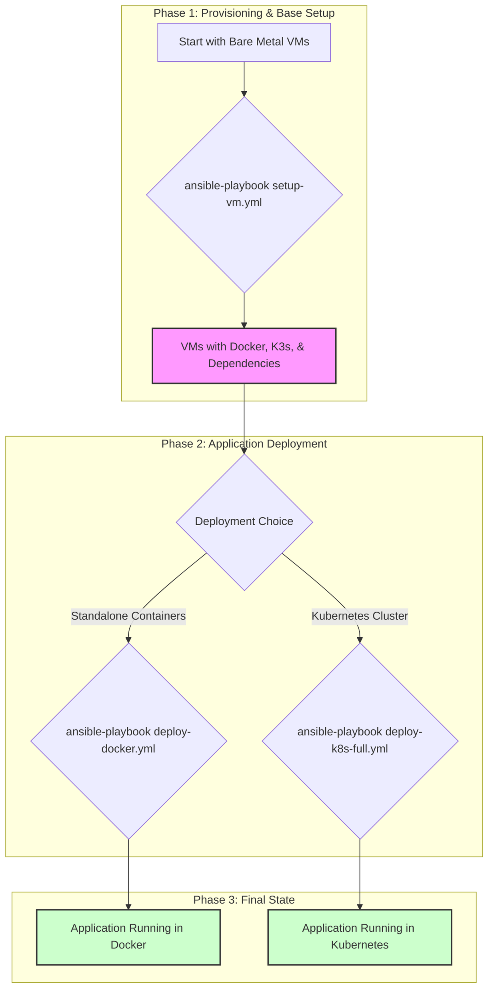

# ⚙️ Ansible Playbooks - FreelancerProject

> **Ομάδα 49** | Infrastructure as Code (IaC) | DIT250 - DevOps

Αυτός ο φάκελος περιέχει τα **Ansible playbooks** που χρησιμοποιούμε για την αυτοματοποίηση της παραμετροποίησης των εικονικών μηχανών (VMs) και την ανάπτυξη (deployment) της εφαρμογής μας. Η χρήση του Ansible μας επιτρέπει να διαχειριζόμαστε την υποδομή ως κώδικα (Infrastructure as Code), εξασφαλίζοντας επαναληψιμότητα, συνέπεια και αξιοπιστία στη διαδικασία.

## 📜 1. Φιλοσοφία και Στρατηγική

Η στρατηγική μας για το configuration management βασίζεται σε δύο βασικούς πυλώνες:

1.  **Immutable Infrastructure**: Δεν τροποποιούμε ποτέ "ζωντανά" συστήματα. Αντίθετα, χρησιμοποιούμε τα playbooks για να στήσουμε από την αρχή ένα νέο, πλήρως παραμετροποιημένο περιβάλλον.
2.  **Idempotency**: Όλα τα playbooks είναι γραμμένα με τέτοιο τρόπο ώστε να μπορούν να εκτελεστούν πολλές φορές χωρίς να προκαλούν ανεπιθύμητες αλλαγές. Το Ansible εξασφαλίζει ότι το σύστημα θα βρίσκεται πάντα στην επιθυμητή κατάσταση που περιγράφεται στα αρχεία YAML.

## 🏗️ 2. Ροή Εργασιών με Ansible

Η διαδικασία που ακολουθούμε για το στήσιμο ενός νέου περιβάλλοντος από το μηδέν είναι η παρακάτω. Κάθε βήμα αντιστοιχεί σε ένα ή περισσότερα playbooks.



##  playbook 3. Ανάλυση των Playbooks

### `inventory.yml`
Αυτό είναι το αρχείο απογραφής (inventory). Εδώ ορίζουμε τις ομάδες των servers μας (π.χ., `masters`, `workers`) και τις μεταβλητές που τους αφορούν, όπως οι διευθύνσεις IP και τα credentials σύνδεσης (π.χ., `ansible_user`, `ansible_ssh_private_key_file`).

### `setup-vm.yml`
Αυτό είναι το θεμελιώδες playbook μας. Είναι υπεύθυνο για την αρχική παραμετροποίηση ενός "γυμνού" VM (συνήθως Ubuntu). Οι κύριες του αρμοδιότητες είναι:
-   Ενημέρωση των πακέτων του συστήματος (`apt update`, `apt upgrade`).
-   Εγκατάσταση βασικών εργαλείων (π.χ., `vim`, `git`, `curl`).
-   Εγκατάσταση του **Docker Engine**.
-   Εγκατάσταση του **K3s** (μια ελαφριά διανομή Kubernetes) στους master και worker κόμβους.
-   Ρύθμιση των απαραίτητων δικαιωμάτων για τους χρήστες.

### `deploy-docker.yml`
Αυτό το playbook αναλαμβάνει την ανάπτυξη της εφαρμογής μας χρησιμοποιώντας απλά Docker containers, χωρίς ενορχηστρωτή. Είναι ιδανικό για γρήγορες δοκιμές και απλά περιβάλλοντα.
-   Δημιουργεί τα απαιτούμενα δίκτυα (networks) στο Docker.
-   Εκκινεί τα containers για το backend, το frontend, τη βάση δεδομένων (PostgreSQL) και το MinIO, χρησιμοποιώντας τις τελευταίες εκδόσεις των images από το Docker Hub.
-   Περνάει τις απαραίτητες μεταβλητές περιβάλλοντος (environment variables) σε κάθε container.

### `deploy-k8s-full.yml`
Αυτό είναι το πιο σύνθετο playbook μας και αναλαμβάνει την πλήρη ανάπτυξη της εφαρμογής σε ένα cluster **Kubernetes**.
-   Εφαρμόζει τα manifests (YAML files) που βρίσκονται στον φάκελο `kubernetes/`.
-   Δημιουργεί τα `Deployments` και `StatefulSets` για κάθε microservice.
-   Ρυθμίζει τα `Services` για την εσωτερική επικοινωνία μεταξύ των pods.
-   Δημιουργεί τα `ConfigMaps` και `Secrets` για τη διαχείριση της παραμετροποίησης.
-   Ρυθμίζει το `Ingress` για να εκθέσει το frontend στον έξω κόσμο.

### `deploy-all.yml`
Ένα "meta" playbook που απλά εισάγει και εκτελεί τα άλλα playbooks με τη σωστή σειρά (`setup-vm.yml` και μετά `deploy-k8s-full.yml`). Χρησιμοποιείται για την πλήρη αυτοματοποίηση της διαδικασίας από την αρχή μέχρι το τέλος με μία μόνο εντολή.

## 🚀 4. Εκτέλεση

Για να εκτελέσετε ένα playbook, χρησιμοποιείτε την εντολή `ansible-playbook` από τον ριζικό φάκελο του project.

**Παράδειγμα: Πλήρης εγκατάσταση σε νέο περιβάλλον**
```bash
# Βεβαιωθείτε ότι το inventory.yml είναι σωστά ρυθμισμένο
# με τις IP των νέων VMs.

# Εκτελέστε το playbook που τα κάνει όλα!
ansible-playbook ansible/deploy-all.yml -i ansible/inventory.yml
```

**Παράδειγμα: Απλή ανάπτυξη μόνο με Docker**
```bash
# Αν τα VMs είναι ήδη στημένα (έχει τρέξει το setup-vm.yml)
# μπορείτε να κάνετε deploy μόνο την εφαρμογή.
ansible-playbook ansible/deploy-docker.yml -i ansible/inventory.yml
```

---
**Ομάδα 49 | Harokopio University of Athens | DevOps Project 2025** 