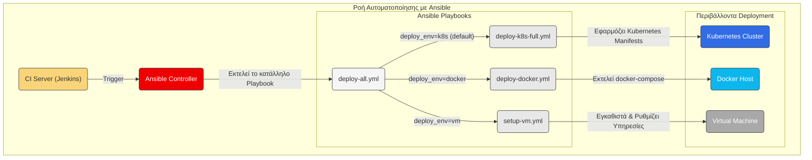

# Τεκμηρίωση Ansible

Καλωσορίσατε στην τεκμηρίωση για την αυτοματοποίηση του deployment με Ansible. Αυτός ο φάκελος περιέχει όλα τα playbooks που απαιτούνται για την εγκατάσταση και παραμετροποίηση της εφαρμογής **Freelance Project** σε τρία διαφορετικά περιβάλλοντα: Kubernetes, Docker και απευθείας σε Virtual Machine (VM).

---

## 🏛️ Ροή Αυτοματοποίησης

Το Ansible αποτελεί τον πυρήνα της στρατηγικής αυτοματοποίησής μας. Τα playbooks μπορούν να εκτελεστούν είτε χειροκίνητα από έναν developer/admin, είτε αυτόματα από το Jenkins CI/CD pipeline. Το παρακάτω διάγραμμα απεικονίζει αυτή τη ροή.



---

## 📜 Περιγραφή Αρχείων & Playbooks

*   **`inventory.yml`**:
    *   **Σκοπός**: Αυτό είναι το αρχείο inventory. Εδώ ορίζουμε τις ομάδες των hosts (π.χ., `kubernetes`, `docker`, `vms`) και τις μεταβλητές που αντιστοιχούν σε αυτούς, όπως IPs, χρήστες SSH, κ.λπ.

*   **`deploy-k8s-full.yml`**:
    *   **Σκοπός**: Το playbook για το πλήρες deployment της εφαρμογής σε ένα Kubernetes cluster.
    *   **Τι κάνει**: Χρησιμοποιεί το module `k8s` του Ansible για να εφαρμόσει ένα προς ένα όλα τα manifest files που βρίσκονται στον φάκελο `kubernetes/`. Δημιουργεί το namespace, τα deployments, τα services και το ingress.
    *   **Παράδειγμα χρήσης**:
        ```bash
        ansible-playbook -i ansible/inventory.yml ansible/deploy-k8s-full.yml
        ```

*   **`deploy-docker.yml`**:
    *   **Σκοπός**: Το playbook για το deployment της εφαρμογής με χρήση Docker Compose.
    *   **Τι κάνει**: Χρησιμοποιεί το module `docker_compose` του Ansible για να εκτελέσει το `docker-compose.yml` στον remote host. Εξασφαλίζει ότι τα containers θα ξεκινήσουν και θα δικτυωθούν σωστά.
    *   **Παράδειγμα χρήσης**:
        ```bash
        ansible-playbook -i ansible/inventory.yml ansible/deploy-docker.yml
        ```

*   **`setup-vm.yml`**:
    *   **Σκοπός**: Ένα πιο σύνθετο playbook που αναλαμβάνει την πλήρη παραμετροποίηση μιας "καθαρής" VM.
    *   **Τι κάνει**: Εκτελεί μια σειρά από tasks: ενημερώνει τα πακέτα του συστήματος, εγκαθιστά απαραίτητες εξαρτήσεις (π.χ., Java, Docker), κλωνοποιεί το project από το Git, και τέλος, τρέχει την εφαρμογή.
    *   **Παράδειγμα χρήσης**:
        ```bash
        ansible-playbook -i ansible/inventory.yml ansible/setup-vm.yml
        ```

*   **`deploy-all.yml`**:
    *   **Σκοπός**: Ένα κεντρικό, "master" playbook που μπορεί να καλέσει οποιοδήποτε από τα παραπάνω ανάλογα με την παράμετρο που θα του δοθεί.
    *   **Τι κάνει**: Ελέγχει την τιμή της μεταβλητής `deploy_env` και, ανάλογα, κάνει include το αντίστοιχο playbook (`-k8s`, `-docker`, ή `-vm`). Αυτό προσφέρει ένα ενιαίο σημείο εισόδου για το CI/CD pipeline.
    *   **Παράδειγμα χρήσης**:
        ```bash
        # Deploy σε Kubernetes (default)
        ansible-playbook -i ansible/inventory.yml ansible/deploy-all.yml

        # Deploy σε Docker
        ansible-playbook -i ansible/inventory.yml ansible/deploy-all.yml --extra-vars "deploy_env=docker"
        ``` 