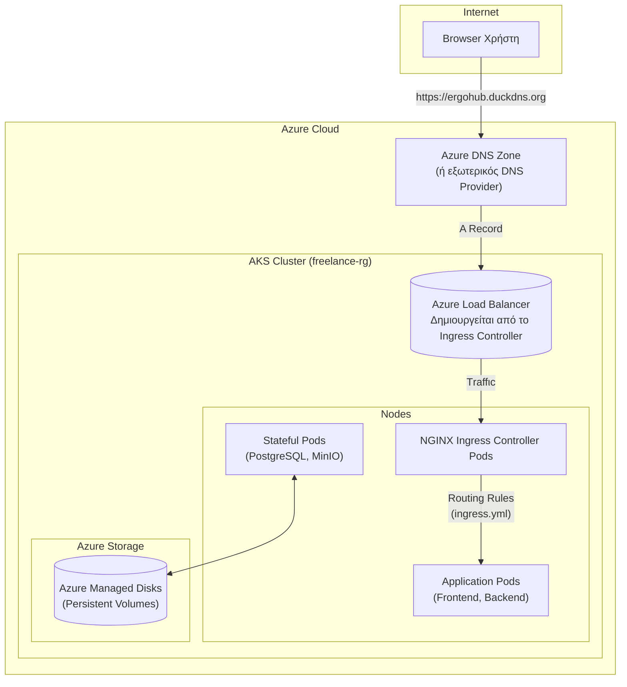

# 🚀 Ανάπτυξη στο Azure Kubernetes Service (AKS) - FreelancerProject

> **Ομάδα 49** | Public Cloud Deployment | DIT250 - DevOps

Αυτό το έγγραφο περιγράφει βήμα προς βήμα τη διαδικασία για την ανάπτυξη της εφαρμογής FreelancerProject σε ένα **Azure Kubernetes Service (AKS)** cluster. Ο τελικός στόχος είναι η εφαρμογή να είναι δημόσια προσβάσιμη μέσω ενός **πλήρως αναγνωρισμένου ονόματος τομέα (FQDN)** με **HTTPS**, εκπληρώνοντας τις απαιτήσεις της εργασίας.

## 🏛️ 1. Αρχιτεκτονική στο Azure

Η αρχιτεκτονική στο Azure αξιοποιεί διαχειριζόμενες υπηρεσίες για να μειώσει την πολυπλοκότητα της διαχείρισης και να αυξήσει την αξιοπιστία.


**Ροή:**
1.  Ο χρήστης πλοηγείται στο FQDN της εφαρμογής (`https://ergohub.duckdns.org`).
2.  Το DNS επιλύει το όνομα στη δημόσια IP του **Azure Load Balancer** που έχει δημιουργηθεί αυτόματα από τον NGINX Ingress Controller.
3.  Ο Load Balancer προωθεί την κίνηση στα pods του **Ingress Controller** μέσα στο AKS.
4.  Ο Ingress Controller, χρησιμοποιώντας τους κανόνες από το `ingress.yml`, διαχειρίζεται το TLS termination (HTTPS) και προωθεί το αίτημα στο κατάλληλο service (frontend ή backend).
5.  Για stateful υπηρεσίες όπως η βάση δεδομένων, τα `StatefulSets` συνδέονται με **Azure Managed Disks** μέσω `PersistentVolumeClaims` για μόνιμη αποθήκευση.

## ✅ 2. Προαπαιτούμενα

Πριν ξεκινήσετε, βεβαιωθείτε ότι έχετε:
1.  **Azure Subscription**: Μια ενεργή συνδρομή στο Microsoft Azure.
2.  **Azure CLI**: Εγκατεστημένο το `az` CLI και συνδεδεμένο στον λογαριασμό σας (`az login`).
3.  **`kubectl`**: Εγκατεστημένο το command-line tool του Kubernetes.
4.  **`helm`**: Εγκατεστημένο το package manager του Kubernetes.
5.  **DuckDNS (ή άλλο) Domain**: Ένα FQDN ρυθμισμένο να δείχνει στη δημόσια IP του Ingress.

## 🚀 3. Βήματα Ανάπτυξης

### Βήμα 1: Εκτέλεση του `deploy.sh`
Το σενάριο `azure/deploy.sh` έχει σχεδιαστεί για να αυτοματοποιήσει τα περισσότερα βήματα της αρχικής ρύθμισης. Τροποποιήστε τις μεταβλητές στην αρχή του script (RESOURCE_GROUP, CLUSTER_NAME, LOCATION) σύμφωνα με τις προτιμήσεις σας.

**Τι κάνει το script:**
-   Δημιουργεί ένα **Resource Group**.
-   Δημιουργεί το **AKS cluster**.
-   Ρυθμίζει το `kubectl` για να συνδεθεί στο νέο cluster (`az aks get-credentials`).
-   Εγκαθιστά τον **NGINX Ingress Controller** χρησιμοποιώντας Helm. Αυτό το βήμα δημιουργεί και τον δημόσιο Azure Load Balancer.
-   Εγκαθιστά τον **cert-manager** χρησιμοποιώντας Helm, ο οποίος θα αναλάβει την αυτόματη έκδοση και ανανέωση των SSL πιστοποιητικών από το Let's Encrypt.
-   Εφαρμόζει τα manifests από τον φάκελο `kubernetes/` (Namespace, ConfigMaps, Deployments, Services κ.λπ.).

**Εκτέλεση:**
```bash
# Δώστε δικαιώματα εκτέλεσης στο script
chmod +x azure/deploy.sh

# Εκτελέστε το script
./azure/deploy.sh
```

### Βήμα 2: Ρύθμιση DNS
Μετά την επιτυχή εγκατάσταση του NGINX Ingress Controller, πρέπει να βρείτε τη δημόσια IP που του έχει αποδοθεί.
```bash
# Περιμένετε λίγα λεπτά μέχρι να εμφανιστεί η IP στη στήλη EXTERNAL-IP
kubectl get service -n ingress-nginx ingress-nginx-controller
```
Αντιγράψτε την `EXTERNAL-IP`. Πηγαίνετε στο [DuckDNS.org](https://www.duckdns.org/) και βεβαιωθείτε ότι το domain `ergohub` δείχνει σε αυτή τη νέα IP.

### Βήμα 3: Επαλήθευση του Ingress
Το αρχείο `kubernetes/ingress.yml` είναι ήδη ρυθμισμένο με τα σωστά ονόματα (`ergohub.duckdns.org`, `api-ergohub.duckdns.org` κ.λπ.). Δεν χρειάζεται να το αλλάξετε, αλλά αν δεν το έχετε εφαρμόσει ακόμα, μπορείτε να το κάνετε τώρα:
```bash
kubectl apply -f kubernetes/ingress.yml
```

### Βήμα 4: Επαλήθευση Πιστοποιητικού
Ο `cert-manager` θα δει το Ingress resource και θα επικοινωνήσει αυτόματα με το Let's Encrypt για να εκδώσει πιστοποιητικό. Αυτή η διαδικασία μπορεί να πάρει 2-5 λεπτά.

**Έλεγχος της κατάστασης του πιστοποιητικού:**
```bash
# Ελέγξτε για ένα νέο Certificate resource
kubectl get certificate -n freelance

# Περιγράψτε το για να δείτε την πρόοδο και τυχόν σφάλματα
kubectl describe certificate freelance-tls -n freelance
```
Όταν δείτε το μήνυμα `Certificate is valid and up to date`, είστε έτοιμοι.

## ✅ 4. Πρόσβαση στην Εφαρμογή
Ανοίξτε τον browser σας και πλοηγηθείτε στο `https://ergohub.duckdns.org`. Θα πρέπει να δείτε την εφαρμογή να φορτώνει με ασφαλή σύνδεση (λουκέτο).

---
**Ομάδα 49 | Harokopio University of Athens | DevOps Project 2025** 