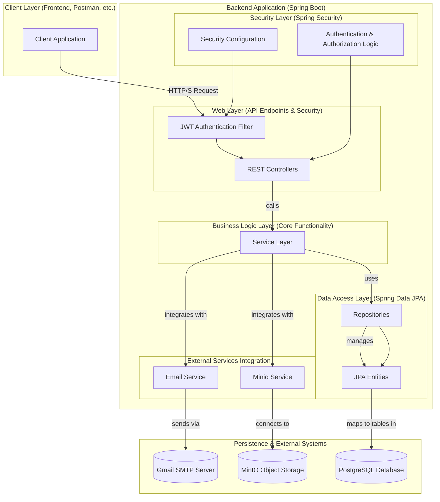
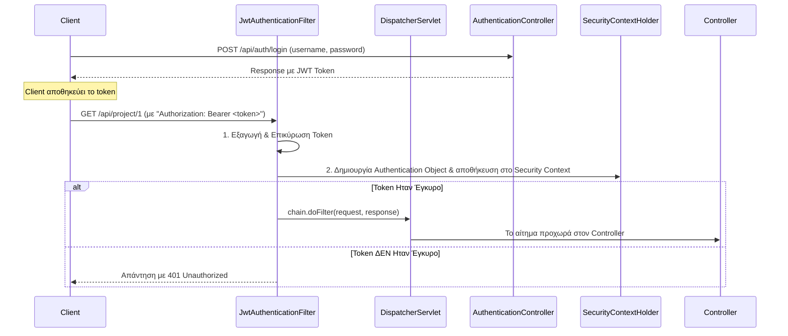
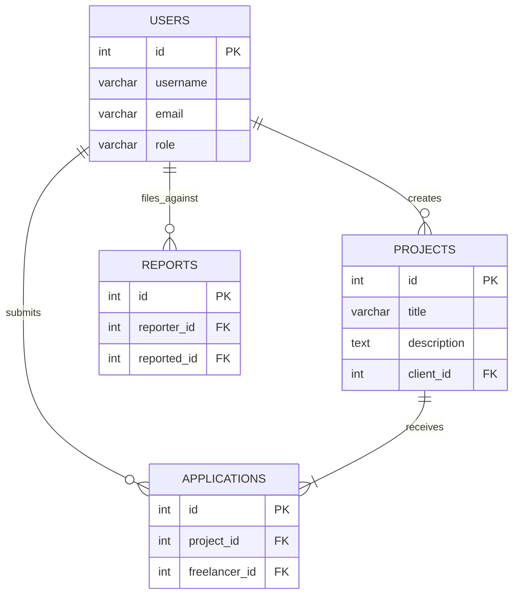

# ⚙️ Backend Application - FreelancerProject

> **Ομάδα 49** | Spring Boot REST API | DIT250 - DevOps

Αυτό το έγγραφο παρέχει μια αναλυτική τεχνική περιγραφή του backend συστήματος της πλατφόρμας FreelancerProject. Υλοποιήσαμε ένα ανθεκτικό και ασφαλές REST API χρησιμοποιώντας **Java 21**, **Spring Boot 3.4.1** και ένα σύνολο από καθιερωμένες τεχνολογίες του Spring οικοσυστήματος.

## 🏗️ 1. Αρχιτεκτονική Backend

Η αρχιτεκτονική του backend μας ακολουθεί το πολυεπίπεδο μοντέλο (Layered Architecture), το οποίο διαχωρίζει με σαφήνεια τις αρμοδιότητες κάθε τμήματος του κώδικα. Αυτό έχει ως αποτέλεσμα ένα σύστημα που είναι ευκολότερο να συντηρηθεί, να επεκταθεί και να ελεγχθεί.



## 📁 2. Δομή Φακέλων

Η δομή των πακέτων στο `src/main/java` είναι οργανωμένη με βάση την αρχιτεκτονική που περιγράψαμε παραπάνω:

```
src/main/java/dit/hua/gr/backend/
├── 📁 config/          # Spring Security, CORS, MinIO configurations
├── 📁 controller/      # REST API endpoints (e.g., ProjectController)
├── 📁 dto/             # Data Transfer Objects για την επικοινωνία με τον client
├── 📁 filter/          # Custom security filters (e.g., JwtAuthenticationFilter)
├── 📁 model/           # JPA Entities που αντιστοιχούν στους πίνακες της βάσης
├── 📁 repository/      # Spring Data JPA interfaces για την αλληλεπίδραση με τη βάση
├── 📁 service/         # Η "καρδιά" της εφαρμογής με την business logic
└── 📄 BackendApplication.java # Κύρια κλάση εκκίνησης της εφαρμογής
```

## 🚀 3. Εγκατάσταση και Τοπική Εκτέλεση

Για να εκτελέσετε το backend τοπικά, θα χρειαστείτε τα παρακάτω:

### Προαπαιτούμενα
- **Java Development Kit (JDK)**: `v21` ή νεότερη
- **Apache Maven**: `v3.8.x` ή νεότερη
- **PostgreSQL**: Εγκατεστημένη και σε λειτουργία
- **MinIO**: Εγκατεστημένο και σε λειτουργία (προαιρετικά, αν θέλετε να δοκιμάσετε το file upload)

### Βήματα Ρύθμισης
1.  **Δημιουργία Βάσης Δεδομένων**:
    -   Ανοίξτε το `psql` ή ένα εργαλείο όπως το pgAdmin.
    -   Δημιουργήστε μια νέα βάση δεδομένων:
        ```sql
        CREATE DATABASE freelance_db;
        ```
2.  **Ρύθμιση `application.properties`**:
    -   Αντιγράψτε το `src/main/resources/application-dev.properties` και προσαρμόστε τις παραμέτρους για τη βάση δεδομένων και το MinIO.
        ```properties
        # PostgreSQL Configuration
        spring.datasource.url=jdbc:postgresql://localhost:5432/freelance_db
        spring.datasource.username=your_postgres_user
        spring.datasource.password=your_postgres_password

        # MinIO Configuration
        minio.endpoint=http://127.0.0.1:9000
        minio.access.name=your_minio_access_key
        minio.access.secret=your_minio_secret_key
        minio.bucket.name=freelance
        ```
3.  **Εκτέλεση της Εφαρμογής**:
    ```bash
    # Μεταβείτε στον ριζικό φάκελο του project
    
    # Χρησιμοποιήστε το Maven wrapper για να χτίσετε και να εκτελέσετε την εφαρμογή
    # Το προφίλ 'dev' ενεργοποιεί το application-dev.properties
    mvn spring-boot:run -Dspring-boot.run.profiles=dev
    ```
    Το API θα είναι διαθέσιμο στη διεύθυνση `http://localhost:8080`.

## 🔐 4. Υλοποίηση Ασφάλειας

Η ασφάλεια είναι ένα κρίσιμο κομμάτι της εφαρμογής μας. Βασίζεται στο **Spring Security** και στη χρήση **JSON Web Tokens (JWT)**.

### Ροή Αυθεντικοποίησης με JWT

- **Stateless Authentication**: Κάθε αίτημα περιέχει όλες τις απαραίτητες πληροφορίες αυθεντικοποίησης, καθιστώντας το backend stateless.
- **Role-Based Access Control (RBAC)**: Χρησιμοποιούμε την annotation `@PreAuthorize` σε επίπεδο μεθόδου στους controllers για να περιορίσουμε την πρόσβαση με βάση τον ρόλο του χρήστη (π.χ., `@PreAuthorize("hasRole('ADMIN')")`).

## 🗄️ 5. Στρώμα Βάσης Δεδομένων (Data Layer)

Χρησιμοποιούμε **Spring Data JPA** και **Hibernate** για την αλληλεπίδραση με τη βάση δεδομένων PostgreSQL. Αυτό μας επιτρέπει να γράφουμε ελάχιστο "boilerplate" κώδικα για τις CRUD λειτουργίες.

### Διάγραμμα Σχέσης Οντοτήτων (ERD)

- **JPA Repositories**: Interfaces που επεκτείνουν το `JpaRepository`, παρέχοντας έτοιμες μεθόδους για πρόσβαση στα δεδομένα.
- **Custom Queries**: Για πιο σύνθετα ερωτήματα, χρησιμοποιούμε την annotation `@Query` ή τις συμβάσεις ονοματοδοσίας του Spring Data.

## 📝 6. API Endpoints

Το API είναι σχεδιασμένο για να είναι προβλέψιμο και RESTful. Τα κύρια endpoints είναι:

| Endpoint Prefix | Περιγραφή | Βασικός Ρόλος |
|-----------------|------------|----------------|
| `/api/auth`     | Εγγραφή και Σύνδεση χρηστών | Public |
| `/api/user`     | Διαχείριση χρηστών (CRUD) | Admin |
| `/api/project`  | Διαχείριση έργων | Client / Admin |
| `/api/application`| Διαχείριση αιτήσεων | Freelancer / Client |
| `/api/reports`  | Διαχείριση αναφορών | All / Admin |
| `/api/chat`     | Σύστημα επικοινωνίας | Client / Freelancer |
| `/api/notifications` | Ειδοποιήσεις χρηστών | All |

**Παράδειγμα κλήσης με `curl`:**
```bash
# Λήψη όλων των projects (απαιτείται ADMIN role και token)
ADMIN_TOKEN="your_admin_jwt_token"
curl -X GET http://localhost:8080/api/project/allProjects \
  -H "Authorization: Bearer $ADMIN_TOKEN"
```

## 🧪 7. Στρατηγική Testing

- **Unit Tests**: Χρησιμοποιούμε **JUnit 5** και **Mockito** για να ελέγξουμε τα services και τους controllers σε απομόνωση, κάνοντας mock τις εξαρτήσεις τους.
- **Integration Tests**: Με τη χρήση του `@SpringBootTest`, ελέγχουμε ολόκληρες ροές της εφαρμογής, από το HTTP request μέχρι τη βάση δεδομένων.

```bash
# Εκτέλεση όλων των tests
mvn test

# Εκτέλεση tests με συγκεκριμένο προφίλ (π.χ., για ξεχωριστή test database)
mvn test -Dspring.profiles.active=test
```

---
**Ομάδα 49 | Harokopio University of Athens | DevOps Project 2025** 