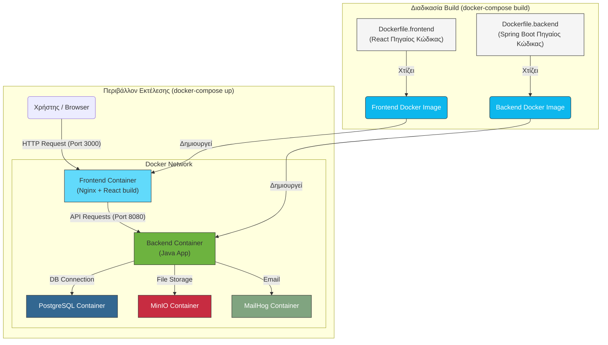

# Τεκμηρίωση Docker

Αυτός ο φάκελος περιέχει όλα τα απαραίτητα αρχεία για την containerization της εφαρμογής μας με τη χρήση του Docker. Η διαδικασία αυτή μας επιτρέπει να "πακετάρουμε" το backend και το frontend σε απομονωμένα, φορητά περιβάλλοντα (containers), διασφαλίζοντας ότι θα τρέχουν με τον ίδιο τρόπο παντού.

---

## 🏛️ Αρχιτεκτονική Docker

Το παρακάτω διάγραμμα δείχνει πώς τα `Dockerfile` χρησιμοποιούνται για να δημιουργήσουν τις Docker images για κάθε υπηρεσία και πώς το `docker-compose` τις ενορχηστρώνει για να δημιουργήσει ένα πλήρες, δικτυωμένο περιβάλλον εφαρμογής.



---

## 📜 Περιγραφή Αρχείων

*   **`Dockerfile.backend`**:
    Αυτό το αρχείο περιέχει τις οδηγίες για τη δημιουργία του Docker image της Spring Boot εφαρμογής. Χρησιμοποιεί μια προσέγγιση multi-stage build:
    1.  **Build Stage**: Χρησιμοποιεί ένα image του Maven για να κάνει compile τον Java κώδικα και να δημιουργήσει το εκτελέσιμο `.jar` αρχείο.
    2.  **Run Stage**: Αντιγράφει μόνο το `.jar` αρχείο σε ένα ελαφρύ image του OpenJDK. Αυτό έχει ως αποτέλεσμα ένα μικρότερο και πιο ασφαλές τελικό image.

*   **`Dockerfile.frontend`**:
    Αυτό το αρχείο δημιουργεί το Docker image για την React εφαρμογή. Ακολουθεί επίσης πρακτική multi-stage build:
    1.  **Build Stage**: Χρησιμοποιεί ένα image του Node.js για να εγκαταστήσει τις εξαρτήσεις (`npm install`) και να δημιουργήσει τα στατικά αρχεία της εφαρμογής (`npm run build`).
    2.  **Run Stage**: Αντιγράφει τα στατικά αρχεία που δημιουργήθηκαν σε έναν ελαφρύ Nginx server, ο οποίος είναι βελτιστοποιημένος για το σερβίρισμα στατικού περιεχομένου.

*   **`docker-compose.yml`**:
    Αυτό είναι το κεντρικό αρχείο ενορχήστρωσης. Ορίζει όλες τις υπηρεσίες που αποτελούν την εφαρμογή μας (backend, frontend, database, minio, mailhog), πώς συνδέονται μεταξύ τους (δίκτυο) και ποια ports εκθέτουν στον host υπολογιστή. Είναι ιδανικό για να σηκώσουμε ολόκληρο το περιβάλλον για τοπική ανάπτυξη και testing με μία μόνο εντολή.

*   **`docker-compose-jenkins.yml`**:
    Ένα εξειδικευμένο αρχείο compose που χρησιμοποιείται αποκλειστικά για να τρέξει την υπηρεσία του Jenkins, απομονώνοντάς την από την κύρια εφαρμογή.

---

## 🚀 Οδηγίες Χρήσης (Docker Compose)

Για να διαχειριστείτε ολόκληρο το περιβάλλον της εφαρμογής, χρησιμοποιήστε τις παρακάτω εντολές από τον φάκελο `docker/`.

*   **Εκκίνηση του περιβάλλοντος:**
    Αυτή η εντολή θα κάνει build τις images (αν δεν υπάρχουν ήδη) και θα ξεκινήσει όλα τα containers.
    ```bash
    docker-compose up -d
    ```
    Το `-d` (detached mode) τα τρέχει στο background.

*   **Παρακολούθηση των logs:**
    Για να δείτε τα logs από όλα τα containers σε πραγματικό χρόνο:
    ```bash
    docker-compose logs -f
    ```

*   **Σταμάτημα του περιβάλλοντος:**
    Αυτή η εντολή σταματά και αφαιρεί τα containers και το δίκτυο που δημιουργήθηκαν.
    ```bash
    docker-compose down
    ``` 