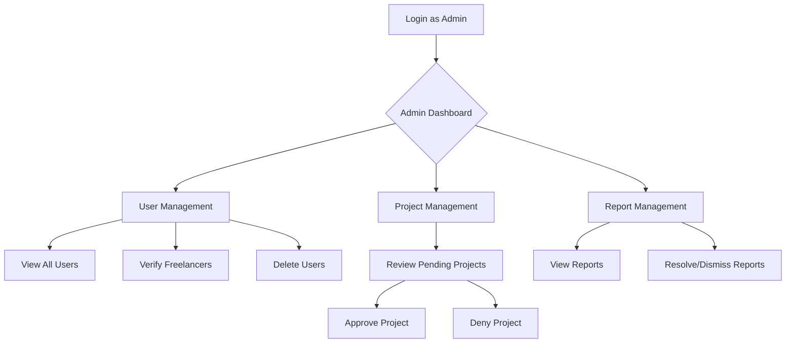
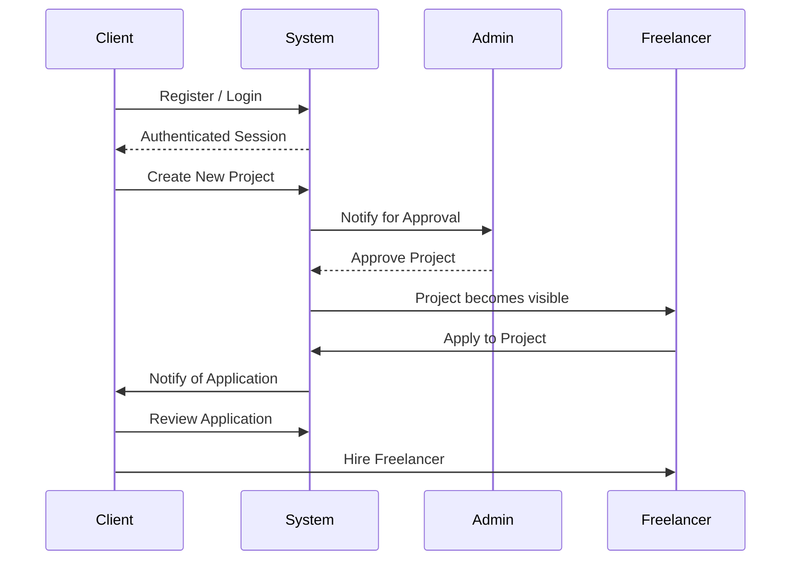
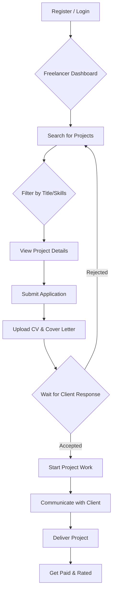

# 📘 FreelancerProject - Εγχειρίδιο Χρήσης

> **Ομάδα 49** | Κωνσταντίνος Παπαδόγιαννης (2022141), Anastasiia Zervas (2022119)

Καλωσήρθατε στο εγχειρίδιο χρήσης της πλατφόρμας FreelancerProject. Αυτός ο οδηγός παρέχει αναλυτικές οδηγίες για όλες τις λειτουργίες της εφαρμογής, προσαρμοσμένες για κάθε ρόλο χρήστη.

## 🚀 1. Γενική Επισκόπηση

Η πλατφόρμα μας είναι ένα ψηφιακό marketplace που σχεδιάσαμε για να συνδέει πελάτες (Clients) που αναζητούν ταλέντα στον τομέα της πληροφορικής με εξειδικευμένους επαγγελματίες (Freelancers). Ένας διαχειριστής (Admin) επιβλέπει τη λειτουργία της πλατφόρμας για να διασφαλίσει την ποιότητα και την ασφάλεια.

### 🔑 Βασικές Έννοιες
- **Projects**: Εργασίες που δημοσιεύονται από τους πελάτες.
- **Applications**: Προτάσεις που υποβάλλουν οι freelancers για τα έργα.
- **Roles**: Admin, Client, Freelancer, ο καθένας με διαφορετικά δικαιώματα.
- **Dashboard**: Το κεντρικό σημείο ελέγχου για κάθε χρήστη.

## 👨‍💼 2. Οδηγός Διαχειριστή (Admin)

Ο ρόλος του Admin είναι κρίσιμος για την εύρυθμη λειτουργία της πλατφόρμας. Ο διαχειριστής έχει την υψηλότερη εποπτεία και εκτελεί τις παρακάτω ενέργειες.

### 📈 Ροή Εργασιών Διαχειριστή


### 2.1 Dashboard Διαχειριστή
Μετά το login, ο διαχειριστής μεταφέρεται στο κεντρικό dashboard, το οποίο παρέχει μια συνολική εικόνα της πλατφόρμας:
- **Στατιστικά**: Αριθμός χρηστών, ενεργά έργα, αιτήσεις υπό εξέταση.
- **Pending Actions**: Λίστα με έργα και αναφορές που απαιτούν άμεση προσοχή.
- **Shortcuts**: Γρήγορη πλοήγηση στις βασικές λειτουργίες διαχείρισης.

### 2.2 Διαχείριση Χρηστών
- **Προβολή**: Ο Admin μπορεί να δει μια λίστα όλων των εγγεγραμμένων χρηστών (`GET /user/all`).
- **Επαλήθευση Freelancer**: Για να αυξηθεί η αξιοπιστία, ο Admin μπορεί να επαληθεύσει τα προφίλ των freelancers μετά από έλεγχο των στοιχείων τους.
- **Διαγραφή Χρήστη**: Δυνατότητα διαγραφής χρηστών που παραβιάζουν τους όρους χρήσης.

### 2.3 Διαχείριση Έργων
Κάθε έργο που δημιουργείται από έναν πελάτη περνά από έγκριση από τον Admin.
- **Review Pending Projects**: Προβολή όλων των έργων που βρίσκονται σε κατάσταση "PENDING".
- **Approve Project**: Μετά την έγκριση, το έργο γίνεται ορατό στους freelancers (`PUT /project/{id}/approve`).
- **Deny Project**: Σε περίπτωση απόρριψης, το έργο δεν δημοσιεύεται και ο πελάτης ενημερώνεται.

### 2.4 Διαχείριση Αναφορών
- **Review Reports**: Προβολή αναφορών που έχουν υποβληθεί από χρήστες για προβλήματα σε έργα ή συμπεριφορές.
- **Resolve/Dismiss**: Ο Admin μπορεί να επιλύσει τη διαφορά ή να απορρίψει την αναφορά ως αβάσιμη.

## 🏢 3. Οδηγός Πελάτη (Client)

Ο πελάτης είναι ο χρήστης που επιθυμεί να υλοποιήσει ένα έργο πληροφορικής και αναζητά τον κατάλληλο επαγγελματία.

### 📈 Ροή Εργασιών Πελάτη


### 3.1 Δημιουργία και Διαχείριση Έργων
- **Δημιουργία Έργου**: Ο πελάτης συμπληρώνει μια φόρμα (`POST /project/{username}/post`) με:
    - **Τίτλο** του έργου.
    - **Λεπτομερή Περιγραφή**.
    - **Προϋπολογισμό** (Budget).
    - **Προθεσμία** (Deadline).
    - **Απαιτούμενες Δεξιότητες** (Skills).
- **Παρακολούθηση Έργων**: Στο dashboard του, ο πελάτης βλέπει όλα τα έργα του και την κατάστασή τους (Pending, Approved, In Progress, Completed).
- **Προβολή Αιτήσεων**: Για κάθε εγκεκριμένο έργο, ο πελάτης μπορεί να δει τις αιτήσεις από τους freelancers (`GET /client/{username}/my-applications`).

### 3.2 Επιλογή Freelancer
- **Αξιολόγηση Προφίλ**: Ο πελάτης εξετάζει το προφίλ, το portfolio και το CV κάθε freelancer που έκανε αίτηση.
- **Επικοινωνία**: Μπορεί να επικοινωνήσει μέσω chat για να διευκρινίσει λεπτομέρειες.
- ** πρόσληψη**: Ο πελάτης επιλέγει τον καταλληλότερο freelancer, και το έργο περνά σε κατάσταση "In Progress".

## 👨‍💻 4. Οδηγός Freelancer

Ο freelancer είναι ο επαγγελματίας που αναζητά εργασία και προσφέρει τις υπηρεσίες του.

### 📈 Ροή Εργασιών Freelancer


### 4.1 Αναζήτηση και Υποβολή Αίτησης
- **Αναζήτηση Έργων**: Ο freelancer μπορεί να αναζητήσει διαθέσιμα έργα χρησιμοποιώντας φίλτρα (`GET /project/title/{title}`).
- **Προβολή Έργου**: Κάνοντας κλικ σε ένα έργο, βλέπει όλες τις λεπτομέρειες που παρείχε ο πελάτης.
- **Υποβολή Αίτησης**: Αν ένα έργο τον ενδιαφέρει, υποβάλλει αίτηση (`POST /project/{projectId}/apply/{username}`) επισυνάπτοντας:
    - **Το βιογραφικό του (CV)**, το οποίο ανεβάζει μέσω του συστήματος MinIO.
    - **Μια συνοδευτική επιστολή (Cover Letter)**.
    - **Μια προτεινόμενη αμοιβή (Proposed Budget)**.

### 4.2 Διαχείριση Προφίλ και Αιτήσεων
- **Προφίλ Freelancer**: Ο freelancer οφείλει να διατηρεί το προφίλ του ενημερωμένο με τις δεξιότητες, την εμπειρία και το portfolio του.
- **Οι Αιτήσεις μου**: Στο dashboard του, βλέπει την κατάσταση όλων των αιτήσεων που έχει υποβάλει (`GET /freelancer/{username}/my-applications`).
- **Ειδοποιήσεις**: Ενημερώνεται αυτόματα μέσω email και ειδοποιήσεων στην πλατφόρμα για την πορεία των αιτήσεών του.

## 🔌 5. API Documentation

Η πλατφόρμα παρέχει ένα πλήρες REST API για την εκτέλεση όλων των λειτουργιών. Η πρόσβαση στα περισσότερα endpoints απαιτεί JWT token.

### Έλεγχος του API με `curl`
Παρακάτω είναι ένα παράδειγμα για το πώς μπορείτε να δοκιμάσετε τη δημιουργία ενός project:
```bash
# 1. Πάρτε ένα JWT token μετά το login
TOKEN="your_jwt_token_here"

# 2. Δημιουργήστε ένα νέο project (ως client)
curl -X POST http://freelance.local/api/project/client_demo/post \
  -H "Authorization: Bearer $TOKEN" \
  -H "Content-Type: application/json" \
  -d '{
    "title":"API Test Project",
    "description":"Project created via API for testing.",
    "budget":"1500",
    "deadline":"2025-09-01",
    "skills":["Java","Spring Boot","API"]
  }'
```

Για μια πλήρη λίστα όλων των endpoints, ανατρέξτε στο `backend/README.md`.

## ❓ 6. Troubleshooting (Επίλυση Προβλημάτων)

- **Πρόβλημα: Δεν μπορώ να κάνω login.**
  - **Λύση**: Βεβαιωθείτε ότι χρησιμοποιείτε τα σωστά credentials. Δοκιμάστε τη λειτουργία "Forgot Password" αν είναι διαθέσιμη ή επικοινωνήστε με τον διαχειριστή.
- **Πρόβλημα: Το project μου δεν εμφανίζεται μετά τη δημιουργία.**
  - **Λύση**: Όλα τα projects πρέπει να εγκριθούν από τον διαχειριστή. Ελέγξτε την κατάστασή του στο dashboard σας. Αν παραμένει "Pending" για πολύ καιρό, επικοινωνήστε με τον Admin.
- **Πρόβλημα: Το ανέβασμα του CV αποτυγχάνει.**
  - **Λύση**: Ελέγξτε ότι το αρχείο είναι σε υποστηριζόμενη μορφή (π.χ., .pdf) και το μέγεθός του δεν υπερβαίνει το επιτρεπτό όριο.

Για οποιοδήποτε άλλο πρόβλημα, μη διστάσετε να επικοινωνήσετε μαζί μας.

---
**Ομάδα 49 - DevOps Project 2025** 