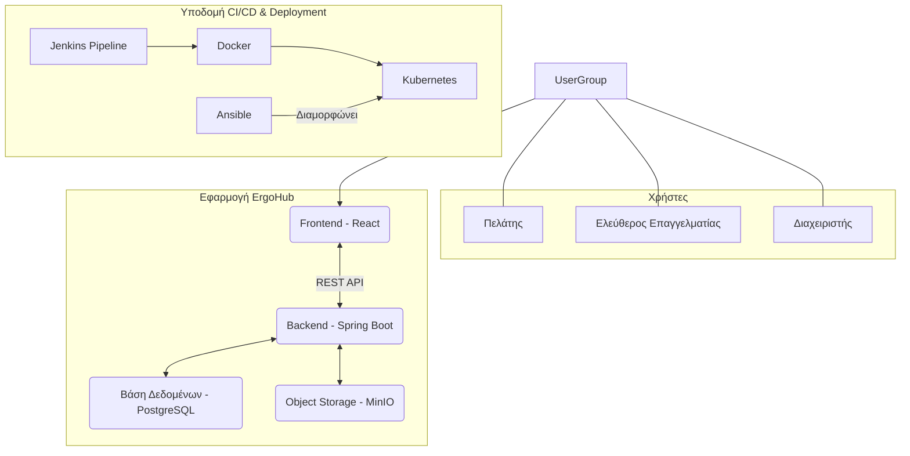
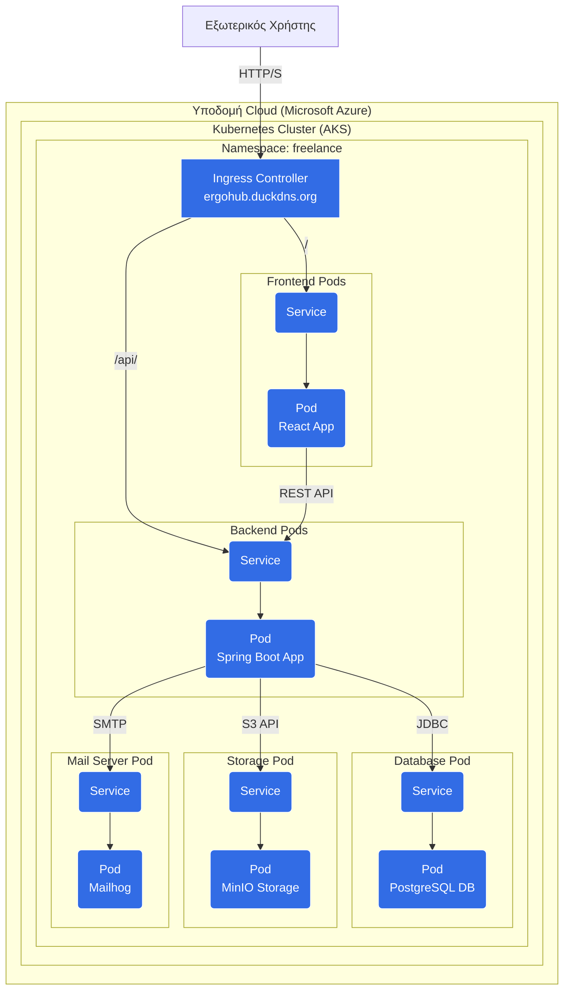

# Αρχιτεκτονική Συστήματος - ErgoHub

## 1. Εισαγωγή

Το παρόν έγγραφο αναλύει την αρχιτεκτονική του συστήματος **ErgoHub**, μιας ολοκληρωμένης πλατφόρμας που συνδέει ελεύθερους επαγγελματίες (Freelancers) με πελάτες (Clients) για την ανάληψη και διαχείριση έργων. Η αρχιτεκτονική έχει σχεδιαστεί με βάση τις σύγχρονες πρακτικές του **Microservices**, **Containerization** και **CI/CD** για να εξασφαλίσει υψηλή διαθεσιμότητα, επεκτασιμότητα και ευκολία στη συντήρηση.

**Ομάδα Ανάπτυξης:**
*   **Ομάδα 49**
    *   Κωνσταντίνος Παπαδόγιαννης
    *   Anastasiia Zervas

---

## 2. Αρχιτεκτονική Υψηλού Επιπέδου (High-Level Architecture)

Το σύστημα αποτελείται από τρία κύρια μέρη: το **Frontend**, το **Backend**, και την **Υποδομή DevOps** που αυτοματοποιεί τη διαδικασία του build, test και deployment.

### 2.1. Ροή Δεδομένων (Data Flow)

1.  **Αίτημα Χρήστη**: Ο χρήστης (Πελάτης, Freelancer ή Διαχειριστής) αλληλεπιδρά με την εφαρμογή μέσω του **Frontend (React)**.
2.  **Επικοινωνία με Backend**: Το Frontend επικοινωνεί με το **Backend (Spring Boot)** μέσω ενός **REST API** για την ανταλλαγή δεδομένων.
3.  **Επεξεργασία & Αποθήκευση**: Το Backend επεξεργάζεται τα αιτήματα, αλληλεπιδρά με τη βάση δεδομένων **PostgreSQL** για την αποθήκευση δομημένων δεδομένων (χρήστες, έργα, αιτήσεις) και με το **MinIO Object Storage** για την αποθήκευση αρχείων (π.χ. βιογραφικά, παραδοτέα έργων).
4.  **Αυθεντικοποίηση & Εξουσιοδότηση**: Η διαχείριση της ταυτότητας των χρηστών γίνεται με **JSON Web Tokens (JWT)**, εξασφαλίζοντας ασφαλή πρόσβαση στους πόρους του API.

---

## 3. Τεχνολογίες (Technology Stack)

| Component          | Technology/Tool                                | Σκοπός                                                                                             |
| ------------------ | ---------------------------------------------- | -------------------------------------------------------------------------------------------------- |
| **Frontend**       | React, Redux, Tailwind CSS                     | Δημιουργία δυναμικού και διαδραστικού User Interface.                                              |
| **Backend**        | Spring Boot (Java), Spring Security, JPA       | Υλοποίηση της επιχειρηματικής λογικής, REST API, και ασφάλειας.                                    |
| **Database**       | PostgreSQL                                     | Σχεσιακή βάση δεδομένων για την αποθήκευση των δεδομένων της εφαρμογής.                             |
| **Object Storage** | MinIO                                          | Αποθήκευση και διαχείριση αρχείων (π.χ. CVs, εικόνες, έγγραφα).                                     |
| **Containerization**| Docker                                         | "Πακετάρισμα" των Frontend και Backend services σε απομονωμένα, μετανοιμα containers.              |
| **Orchestration**  | Kubernetes (AKS - Azure Kubernetes Service)    | Διαχείριση, κλιμάκωση και deployment των Docker containers σε ένα cluster.                           |
| **CI/CD**          | Jenkins                                        | Αυτοματοποίηση των διαδικασιών build, test και deployment (CI/CD pipelines).                        |
| **Configuration**  | Ansible                                        | Αυτοματοποίηση της παραμετροποίησης των servers και του deployment στο Kubernetes cluster.         |
| **Cloud Provider** | Microsoft Azure                                | Φιλοξενία του Kubernetes cluster και των σχετικών πόρων.                                            |
| **Web Server/Proxy**| Nginx                                          | Ingress Controller στο Kubernetes για routing των αιτημάτων στα σωστά services.                    |

---

## 4. Αρχιτεκτονική Υποδομής & Deployment

Η εφαρμογή φιλοξενείται σε ένα cluster **Azure Kubernetes Service (AKS)**. Η παρακάτω απεικόνιση δείχνει τη δομή των πόρων εντός του cluster.

### Λεπτομέρειες Deployment:

*   **Namespace**: Όλοι οι πόροι της εφαρμογής αναπτύσσονται σε ένα αποκλειστικό namespace (`freelance`) για καλύτερη οργάνωση και απομόνωση.
*   **Ingress Controller**: Ένα **Nginx Ingress Controller** διαχειρίζεται την εισερχόμενη κίνηση από το διαδίκτυο (`ergohub.duckdns.org`) και την προωθεί στα κατάλληλα services βάσει του path (`/` για το frontend, `/api/` για το backend).
*   **Services & Pods**: Κάθε στοιχείο της εφαρμογής (Frontend, Backend, PostgreSQL, MinIO, Mailhog) τρέχει ως ένα **Deployment** που διαχειρίζεται τα **Pods** του. Ένα αντίστοιχο **Service** εκθέτει τα Pods στο εσωτερικό δίκτυο του cluster, επιτρέποντας την επικοινωνία μεταξύ τους.
*   **Configuration**: Ευαίσθητες πληροφορίες (passwords, API keys) και παραμετροποιήσεις αποθηκεύονται σε **Kubernetes Secrets** και **ConfigMaps** αντίστοιχα, και γίνονται inject στα Pods ως environment variables.
