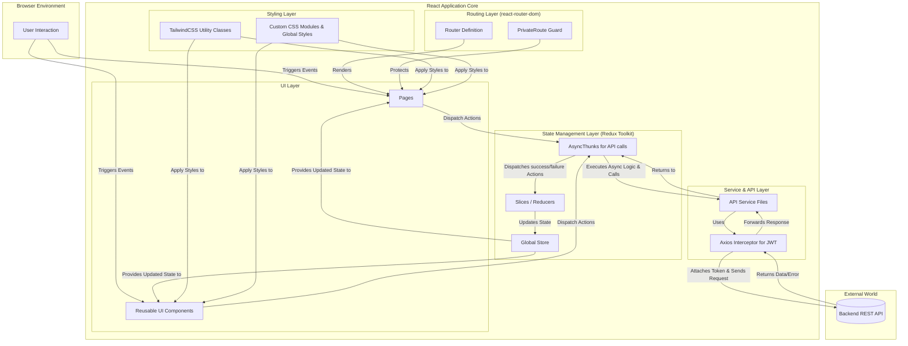
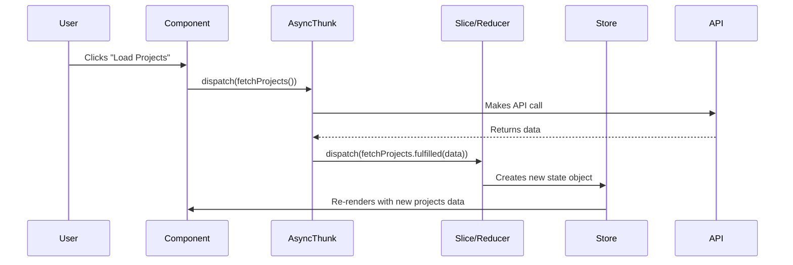
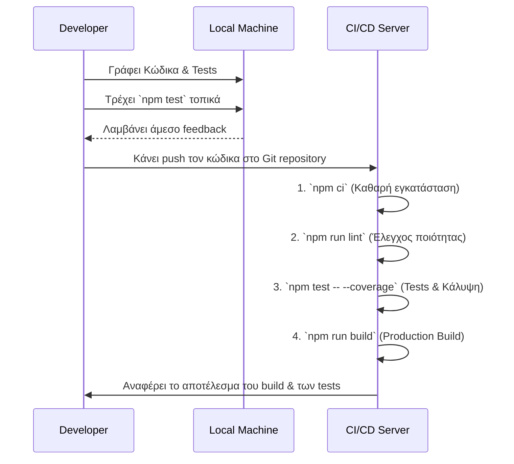

# 📱 Frontend Application - FreelancerProject

> **Ομάδα 49** | React.js SPA Implementation | DIT250 - DevOps

Καλωσήρθατε στην τεχνική τεκμηρίωση του Frontend για το FreelancerProject. Αυτό το έγγραφο περιγράφει την αρχιτεκτονική, τη δομή και τις λειτουργίες του Single Page Application (SPA) που υλοποιήσαμε με **React.js**, **Redux Toolkit** και **TailwindCSS**.

## 🏗️ 1. Αρχιτεκτονική Εφαρμογής

Σχεδιάσαμε το frontend με επίκεντρο την αρχή της διάκρισης των αρμοδιοτήτων (Separation of Concerns). Κάθε μέρος του συστήματος έχει έναν σαφή και διακριτό ρόλο, διευκολύνοντας την ανάπτυξη, τη συντήρηση και το testing.



## 📁 2. Δομή Φακέλων

Η δομή του `src` φακέλου είναι οργανωμένη με βάση τη λειτουργικότητα, ακολουθώντας τα βιομηχανικά πρότυπα για μεγάλα React projects.

```
frontend/src/
├── 📁 __tests__/          # Integration tests που καλύπτουν ολόκληρες ροές
├── 📁 assets/              # Εικόνες, λογότυπα και άλλα στατικά αρχεία
├── 📁 components/          # Επαναχρησιμοποιήσιμα, "dumb" React components
│   └── 📁 __tests__/       # Unit tests για τα components
├── 📁 pages/               # "Smart" components που αντιπροσωπεύουν σελίδες
│   └── 📁 __tests__/       # Tests για τις σελίδες
├── 📁 services/            # Λογική επικοινωνίας με το API
├── 📁 store/               # Redux state management (slices, store config)
├── 📁 styles/              # Global CSS, θέματα και αρχεία styling
├── 📁 utils/               # Βοηθητικές συναρτήσεις
├── 📄 App.jsx              # Κεντρικό component με τη λογική του routing
├── 📄 index.js             # Το σημείο εισόδου (entry point) της εφαρμογής
└── 📄 setupTests.js        # Configuration για το Jest testing environment
```

## 🚀 3. Εγκατάσταση και Τοπική Εκτέλεση

Για να τρέξετε το frontend τοπικά για development, ακολουθήστε τα παρακάτω βήματα.

### Προαπαιτούμενα
- **Node.js**: `v18.x` ή νεότερη
- **npm**: `v9.x` ή νεότερη
- Ένα `.env` αρχείο στον ριζικό φάκελο `frontend/` με τη διεύθυνση του backend API:
  ```env
  REACT_APP_API_URL=http://localhost:8080/api
  ```

### Βήματα Εκτέλεσης
```bash
# 1. Ανοίξτε ένα terminal και πλοηγηθείτε στον φάκελο του frontend
cd frontend

# 2. Εγκαταστήστε όλες τις απαραίτητες εξαρτήσεις.
# Η εντολή 'ci' είναι ταχύτερη και ασφαλέστερη για CI/CD περιβάλλοντα.
npm ci

# 3. Ξεκινήστε τον development server.
# Η εφαρμογή θα ανοίξει αυτόματα στο http://localhost:3000.
npm start
```

## 📜 4. Διαθέσιμα Scripts

Έχουμε ρυθμίσει διάφορα scripts στο `package.json` για την αυτοματοποίηση των διαδικασιών ανάπτυξης και testing.

- `npm start`: Ξεκινά την εφαρμογή σε development mode με hot-reloading.
- `npm run build`: Δημιουργεί ένα βελτιστοποιημένο production build στον φάκελο `build/`.
- `npm test`: Εκτελεί όλα τα unit και integration tests σε watch mode.
- `npm test -- --coverage`: Υπολογίζει την κάλυψη του κώδικα από τα tests.
- `npm run test:integration`: Εκτελεί μόνο τα integration tests που βρίσκονται στον φάκελο `src/__tests__/`.
- `npm run lint`: Ελέγχει τον κώδικα για στυλιστικά και συντακτικά λάθη με το ESLint.
- `npm run lint:fix`: Προσπαθεί να διορθώσει αυτόματα τα προβλήματα που βρίσκει το ESLint.

## 🔄 5. State Management με Redux Toolkit

Χρησιμοποιούμε το **Redux Toolkit** ως τη μοναδική πηγή αλήθειας (single source of truth) για την κατάσταση της εφαρμογής. Αυτή η προσέγγιση μας επιτρέπει να έχουμε προβλέψιμο state και ευκολότερο debugging.

- **Slices**: Χρησιμοποιούμε τη συνάρτηση `createSlice` για να ορίσουμε ένα κομμάτι του state μαζί με τους reducers που το μεταβάλλουν. Έχουμε slices για `auth`, `projects`, `users`, κ.λπ.
- **AsyncThunks**: Για τις ασύγχρονες λειτουργίες (API calls), χρησιμοποιούμε `createAsyncThunk`. Αυτό διαχειρίζεται αυτόματα τις καταστάσεις `pending`, `fulfilled`, και `rejected`, επιτρέποντάς μας να ενημερώνουμε το UI ανάλογα (π.χ., εμφάνιση loading spinner).

### Ροή Δεδομένων στο Redux
Η ροή είναι πάντα μονόδρομη, κάτι που κάνει την εφαρμογή πιο προβλέψιμη.


## 🎨 6. Styling

Η προσέγγισή μας στο styling είναι υβριδική για μέγιστη ευελιξία:
- **TailwindCSS**: Χρησιμοποιείται για το μεγαλύτερο μέρος του styling μέσω utility classes. Αυτό επιταχύνει την ανάπτυξη και διατηρεί το design συνεπές.
- **Custom CSS**: Για πιο σύνθετα ή custom components, χρησιμοποιούμε αρχεία CSS (`.css`) που εισάγονται απευθείας στα components.

## 🧪 7. Στρατηγική Testing

Η στρατηγική μας για το testing διασφαλίζει ότι η εφαρμογή είναι αξιόπιστη και λειτουργεί όπως αναμένεται.

### Testing Workflow


- **Unit Tests**: Ελέγχουν μεμονωμένα components (`<Button>`, `<Card>`, etc.) για να επιβεβαιώσουν ότι κάνουν render σωστά και ανταποκρίνονται σε props.
- **Integration Tests**: Ελέγχουν ολόκληρες ροές χρηστών (π.χ., login flow, project creation) για να επιβεβαιώσουν ότι πολλαπλά components, το Redux store και οι services συνεργάζονται αρμονικά.

---
**Ομάδα 49 | Harokopio University of Athens | DevOps Project 2025**