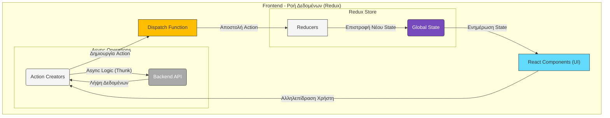

# Frontend Εφαρμογή (React)

Καλωσορίσατε στην τεκμηρίωση για την frontend εφαρμογή του **Freelance Project**. Αυτός ο φάκελος περιέχει όλον τον πηγαίο κώδικα για το user interface της πλατφόρμας, το οποίο είναι χτισμένο με React.

---

## 🛠️ Τεχνολογίες & Βιβλιοθήκες

Το frontend βασίζεται σε ένα σύγχρονο stack τεχνολογιών για να προσφέρει μια γρήγορη και διαδραστική εμπειρία χρήστη.

| Τομέας | Τεχνολογία / Βιβλιοθήκη |
| :--- | :--- |
| **Framework** | `React 19` |
| **State Management** | `Redux Toolkit` |
| **Routing** | `React Router DOM` |
| **API Communication** | `Axios` |
| **Styling** | `Tailwind CSS` |
| **Form Management** | `React Hook Form` |
| **Testing** | `React Testing Library`, `Jest` |
| **Package Manager** | `npm` |

---

## 🏛️ Αρχιτεκτονική & Ροή Δεδομένων

Η διαχείριση της κατάστασης (state) της εφαρμογής γίνεται κεντρικά μέσω του Redux. Το παρακάτω διάγραμμα απεικονίζει την τυπική ροή δεδομένων (unidirectional data flow) όταν ένας χρήστης αλληλεπιδρά με την εφαρμογή.



---

## 🚀 Τοπική Ανάπτυξη (Local Development)

Για να τρέξετε την εφαρμογή τοπικά για development, ακολουθήστε τα παρακάτω βήματα:

1.  **Εγκατάσταση Εξαρτήσεων:**
    Πλοηγηθείτε στον φάκελο `frontend/` και εκτελέστε την παρακάτω εντολή για να εγκαταστήσετε όλες τις απαραίτητες βιβλιοθήκες.
    ```bash
npm install
    ```

2.  **Εκκίνηση του Development Server:**
    Αφού ολοκληρωθεί η εγκατάσταση, ξεκινήστε τον development server.
    ```bash
npm start
    ```
    Η εφαρμογή θα ανοίξει αυτόματα στον browser σας στη διεύθυνση `http://localhost:3000`. Ο server παρακολουθεί τις αλλαγές στα αρχεία και κάνει αυτόματα reload.

    **Σημείωση:** Για την επικοινωνία με το backend, έχει οριστεί ένας `proxy` στο αρχείο `package.json`. Αυτό σημαίνει ότι πρέπει να έχετε και τον backend server να τρέχει ταυτόχρονα (π.χ., από το IDE σας) στη διεύθυνση `http://localhost:8080`.

---

## 📜 Διαθέσιμα Scripts

Στο αρχείο `package.json` θα βρείτε τα παρακάτω χρήσιμα scripts:

*   `npm start`: Ξεκινά τον development server.
*   `npm run build`: Δημιουργεί ένα production-ready build της εφαρμογής στον φάκελο `build/`.
*   `npm test`: Εκτελεί τα tests της εφαρμογής.
*   `npm run lint`: Ελέγχει τον κώδικα για πιθανά σφάλματα και θέματα στυλ με βάση τους κανόνες του ESLint.

---

## 📂 Δομή Φακέλων

Η δομή του πηγαίου κώδικα μέσα στον φάκελο `src/` είναι η εξής:

*   `assets/`: Περιέχει εικόνες και άλλα στατικά αρχεία.
*   `components/`: Περιέχει επαναχρησιμοποιήσιμα React components (π.χ., Header, Footer, Cards).
*   `pages/`: Περιέχει τα βασικά components για κάθε σελίδα της εφαρμογής (π.χ., Home, Login, Dashboard).
*   `services/`: Περιέχει τον κώδικα για την επικοινωνία με το backend API (Axios instances, service functions).
*   `store/`: Περιέχει όλη τη λογική του Redux (reducers, actions, store configuration).
*   `styles/`: Περιέχει τα αρχεία CSS.
*   `utils/`: Περιέχει βοηθητικές συναρτήσεις (π.χ., για authentication). 