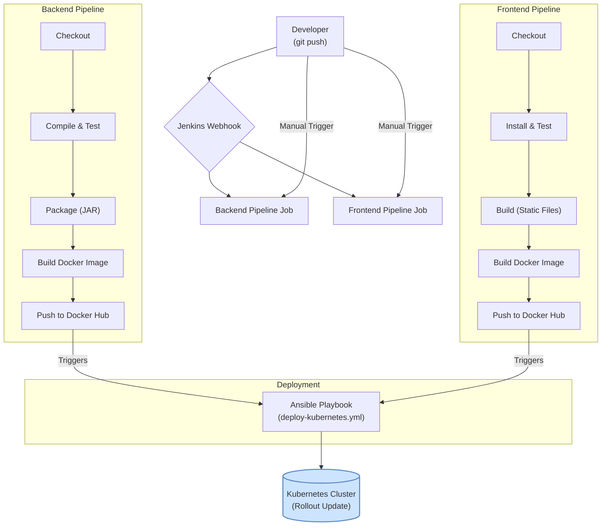

# ⚙️ Jenkins CI/CD Pipelines - FreelancerProject

> **Ομάδα 49** | Continuous Integration & Delivery | DIT250 - DevOps

Αυτός ο φάκελος περιέχει τα **Jenkinsfiles**, τα οποία ορίζουν τις CI/CD (Continuous Integration/Continuous Delivery) διαδικασίες μας ως "Pipeline as Code". Η χρήση του Jenkins μας επιτρέπει να αυτοματοποιήσουμε πλήρως τη διαδικασία ελέγχου, "χτισίματος" και ανάπτυξης της εφαρμογής μας, μειώνοντας τα ανθρώπινα λάθη και αυξάνοντας την ταχύτητα παράδοσης νέων εκδόσεων.

## 🌊 1. Γενική Ροή CI/CD

Η φιλοσοφία μας βασίζεται στη δημιουργία δύο ξεχωριστών, αλλά παράλληλων, pipelines: ένα για το **Backend (Spring Boot)** και ένα για το **Frontend (React)**. Και τα δύο ενεργοποιούνται αυτόματα μετά από ένα `git push` στο `main` branch, ακολουθώντας τα παρακάτω βήματα:

*Σημείωση: Στην πράξη, το deployment step μπορεί να είναι μέρος μόνο ενός από τα δύο pipelines (π.χ. του backend) ή να ενεργοποιείται ανεξάρτητα, αφού και τα δύο images είναι έτοιμα.*

## 📄 2. Ανάλυση Pipelines

### `Jenkinsfile-backend`
Αυτό το pipeline διαχειρίζεται τον κύκλο ζωής της Spring Boot εφαρμογής.

-   **Tools**:
    -   `JDK 21`: Για τη μεταγλώττιση και εκτέλεση του Java κώδικα.
    -   `Maven 3`: Για τη διαχείριση των εξαρτήσεων, το testing και το packaging.
-   **Stages**:
    1.  **Compile**: Μεταγλωττίζει τον κώδικα χωρίς να εκτελεί τα tests (`mvn clean compile`).
    2.  **Unit Tests**: Εκτελεί τα unit tests με το προφίλ `test` για να χρησιμοποιήσει in-memory βάση δεδομένων (`mvn test`). Δημοσιεύει τα αποτελέσματα (JUnit reports).
    3.  **Integration Tests**: Εκτελεί τα integration tests, εστιάζοντας σε συγκεκριμένα test suites.
    4.  **Package**: Δημιουργεί το εκτελέσιμο `.jar` αρχείο, παρακάμπτοντας τα tests που έχουν ήδη εκτελεστεί (`mvn package -DskipTests`).
    5.  **Build Docker Image**: Χρησιμοποιεί το `docker/Dockerfile.backend` για να χτίσει ένα νέο Docker image με tag το τρέχον build number.
    6.  **Push Docker Image**: Κάνει login στο Docker Hub (χρησιμοποιώντας αποθηκευμένα credentials) και ανεβάζει το νέο image στο registry.
    7.  **Deploy to Kubernetes**: Εκτελεί το Ansible playbook `ansible/deploy-kubernetes.yml` για να κάνει rollout την τελευταία έκδοση στο Kubernetes cluster. Χρησιμοποιεί το `kubeconfig` που είναι αποθηκευμένο ως secret στον Jenkins.

### `Jenkinsfile-frontend`
Αυτό το pipeline διαχειρίζεται τον κύκλο ζωής της React εφαρμογής.

-   **Tools**:
    -   `NodeJS 21`: Για την εκτέλεση των npm scripts.
-   **Stages**:
    1.  **Checkout**: Κατεβάζει την τελευταία έκδοση του κώδικα από το `main` branch.
    2.  **Install Dependencies**: Εγκαθιστά τις απαραίτητες Node.js εξαρτήσεις, δίνοντας προτεραιότητα στο `npm ci` για ταχύτερα και πιο αξιόπιστα builds.
    3.  **Lint**: Ελέγχει την ποιότητα του κώδικα με το ESLint.
    4.  **Unit & Integration Tests**: Εκτελεί τις σουίτες των tests με το Jest και παράγει αναφορές κάλυψης (coverage reports).
    5.  **Build**: Δημιουργεί τα βελτιστοποιημένα, στατικά αρχεία (HTML, CSS, JS) της εφαρμογής με την εντολή `npm run build`.
    6.  **Security Audit**: Εκτελεί `npm audit` για να ελέγξει για γνωστές ευπάθειες στις εξαρτήσεις.
    7.  **Build & Push Docker Image**: Όπως και στο backend, χτίζει και ανεβάζει το image του frontend στο Docker Hub.
    8.  **Deploy to Kubernetes**: Εκτελεί το ίδιο Ansible playbook για την ανάπτυξη στο cluster.

## 🚀 3. Ρύθμιση στον Jenkins

Για να δημιουργήσετε τα jobs στον Jenkins για αυτά τα pipelines:

1.  **Δημιουργία Νέου Job**:
    -   Από το dashboard του Jenkins, επιλέξτε **"New Item"**.
    -   Δώστε ένα όνομα (π.χ., `freelance-backend-pipeline`).
    -   Επιλέξτε **"Pipeline"** και πατήστε "OK".

2.  **Ρύθμιση του Pipeline**:
    -   Στην καρτέλα **"General"**, μπορείτε να ρυθμίσετε triggers, όπως το **"GitHub hook trigger for GITScm polling"** για αυτόματη εκτέλεση μετά από push.
    -   Στην ενότητα **"Pipeline"**, κάντε τις παρακάτω ρυθμίσεις:
        -   **Definition**: Επιλέξτε **"Pipeline script from SCM"**.
        -   **SCM**: Επιλέξτε **"Git"**.
        -   **Repository URL**: Εισάγετε το URL του Git repository σας (π.χ., `https://github.com/user/repo.git`).
        -   **Credentials**: Επιλέξτε τα κατάλληλα credentials αν το repository είναι ιδιωτικό.
        -   **Branch Specifier**: Αφήστε το `*/main` για να παρακολουθεί το main branch.
        -   **Script Path**: Εδώ ορίζετε ποιο αρχείο θα εκτελεστεί.
            -   Για το backend job: `jenkins/Jenkinsfile-backend`
            -   Για το frontend job: `jenkins/Jenkinsfile-frontend`
    -   Πατήστε **"Save"**.

3.  **Εκτέλεση**:
    -   Μπορείτε να εκτελέσετε το pipeline χειροκίνητα πατώντας **"Build Now"** ή να κάνετε ένα push στο main branch για να δείτε την αυτόματη εκτέλεση.

---
**Ομάδα 49 | Harokopio University of Athens | DevOps Project 2025** 