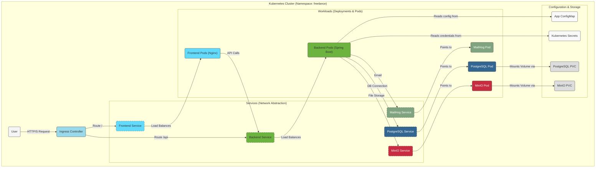

# Τεκμηρίωση Kubernetes

Αυτός ο φάκελος περιέχει όλα τα manifest files (.yml) που απαιτούνται για την ανάπτυξη (deployment) της εφαρμογής **Freelance Project** σε ένα περιβάλλον Kubernetes. Τα αρχεία αυτά περιγράφουν την επιθυμητή κατάσταση (desired state) των πόρων μας μέσα στο cluster.

---

## 🏛️ Αρχιτεκτονική στο Kubernetes

Το παρακάτω διάγραμμα απεικονίζει πώς οι διάφοροι πόροι του Kubernetes (Deployments, Services, Ingress, κ.λπ.) αλληλεπιδρούν μεταξύ τους για να σχηματίσουν την πλήρη αρχιτεκτονική της εφαρμογής μας.



---

## 📜 Περιγραφή Πόρων (Manifest Files)

Κάθε αρχείο `.yml` σε αυτόν τον φάκελο ορίζει έναν ή περισσότερους πόρους του Kubernetes.

*   **`namespace.yml`**:
    *   **Τι κάνει:** Δημιουργεί ένα ξεχωριστό `namespace` με το όνομα `freelance`. Η χρήση namespaces μας επιτρέπει να απομονώνουμε λογικά τους πόρους της εφαρμογής μας από άλλες εφαρμογές που μπορεί να τρέχουν στο ίδιο cluster.

*   **`configmap.yml`**:
    *   **Τι κάνει:** Δημιουργεί ένα `ConfigMap` που περιέχει non-sensitive δεδομένα παραμετροποίησης, όπως τα URLs για τη σύνδεση με τη βάση δεδομένων, το MinIO, κ.λπ. Αυτά τα δεδομένα γίνονται διαθέσιμα στα containers ως μεταβλητές περιβάλλοντος (environment variables).

*   **`postgres-deployment.yml`**:
    *   **Τι κάνει:** Ορίζει τρεις πόρους για τη βάση δεδομένων μας:
        1.  `PersistentVolumeClaim (PVC)`: "Ζητάει" χώρο αποθήκευσης από το cluster για να αποθηκεύονται τα δεδομένα της βάσης μόνιμα.
        2.  `Deployment`: Δημιουργεί τα `Pods` που τρέχουν το container του PostgreSQL.
        3.  `Service`: Δημιουργεί ένα σταθερό σημείο πρόσβασης (ένα εσωτερικό DNS όνομα) για τη βάση δεδομένων, ώστε το backend να μπορεί να συνδεθεί σε αυτήν.

*   **`minio-deployment.yml` & `mailhog-deployment.yml`**:
    *   **Τι κάνουν:** Παρόμοια με το PostgreSQL, αυτά τα αρχεία ορίζουν `Deployments` και `Services` για τις υπηρεσίες MinIO (object storage) και MailHog (email testing). Το MinIO χρησιμοποιεί επίσης ένα `PVC` για μόνιμη αποθήκευση.

*   **`backend-deployment.yml`**:
    *   **Τι κάνει:** Ορίζει το `Deployment` και το `Service` για την backend εφαρμογή μας (Spring Boot). Το `Deployment` διασφαλίζει ότι ένας συγκεκριμένος αριθμός από backend `Pods` θα τρέχει πάντα.

*   **`frontend-deployment.yml`**:
    *   **Τι κάνει:** Ορίζει το `Deployment` και το `Service` για την frontend εφαρμογή (React που σερβίρεται από Nginx).

*   **`ingress.yml`**:
    *   **Τι κάνει:** Ορίζει τους κανόνες του `Ingress`. Αυτός είναι ο πιο κρίσιμος πόρος για την πρόσβαση από το εξωτερικό. Αναλαμβάνει να δρομολογεί την κίνηση από τους χρήστες προς τις κατάλληλες υπηρεσίες (Services) με βάση το path του URL (π.χ., οι κλήσεις στο `/api` πηγαίνουν στο backend, ενώ όλες οι άλλες στο frontend).

---

## 🚀 Τρόπος Χρήσης

Αυτά τα αρχεία δεν προορίζονται συνήθως για χειροκίνητη χρήση. Η ανάπτυξή τους στο cluster γίνεται αυτόματα μέσω του **Ansible**, όπως περιγράφεται στο κεντρικό `README.md` του project.

Ωστόσο, για σκοπούς αποσφαλμάτωσης (debugging), μπορείτε να τα εφαρμόσετε χειροκίνητα με την παρακάτω εντολή από τον φάκελο `kubernetes/`:
```bash
# Εφαρμογή όλων των manifests στον τρέχοντα namespace
kubectl apply -f .
``` 