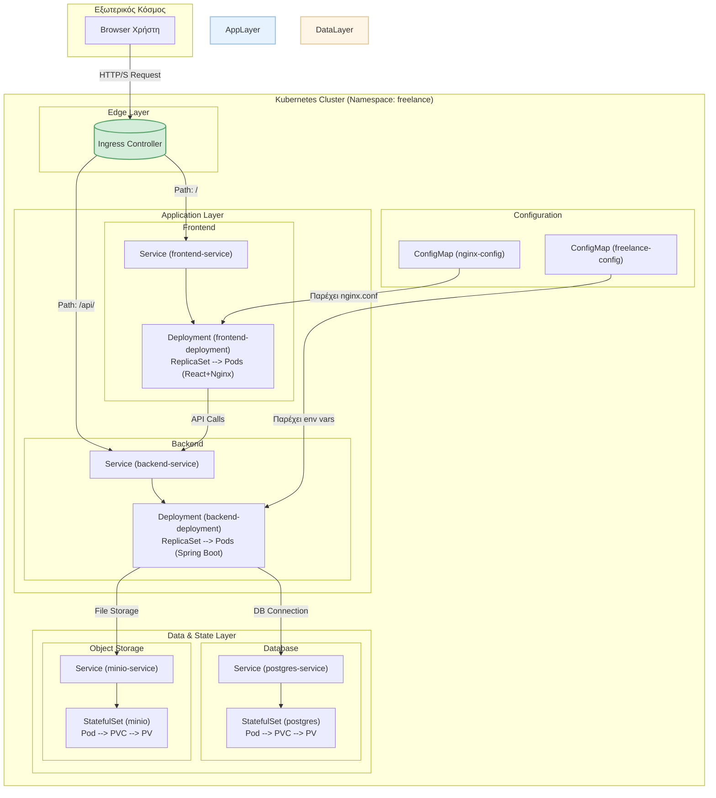

# ☸️ Kubernetes Manifests - FreelancerProject

> **Ομάδα 49** | Cloud-Native Deployment | DIT250 - DevOps

Αυτός ο φάκελος περιέχει όλα τα **Kubernetes manifests** (σε μορφή YAML) που απαιτούνται για την πλήρη ανάπτυξη της εφαρμογής FreelancerProject σε ένα Kubernetes cluster. Η χρήση του Kubernetes μας επιτρέπει να αυτοματοποιήσουμε το deployment, την κλιμάκωση (scaling) και τη διαχείριση των containerized εφαρμογών μας, παρέχοντας υψηλή διαθεσιμότητα και ανθεκτικότητα.

## 🏛️ 1. Αρχιτεκτονική στο Kubernetes

Η αρχιτεκτονική μας στο Kubernetes έχει σχεδιαστεί για να διαχωρίζει τις διάφορες υπηρεσίες και να διαχειρίζεται αποτελεσματικά την κατάσταση (state) και την παραμετροποίηση (configuration).


**Ροή Επικοινωνίας:**
1.  Ένα αίτηma από τον χρήστη φτάνει στον **Ingress Controller** του cluster.
2.  Ο Ingress, βάσει του path (`/` ή `/api/`), προωθεί την κίνηση στο αντίστοιχο **Service** ( `frontend-service` ή `backend-service`).
3.  Το Service λειτουργεί ως load balancer και στέλνει την κίνηση σε ένα από τα διαθέσιμα **Pods** του αντίστοιχου **Deployment**.
4.  Τα Pods του backend επικοινωνούν με τις stateful υπηρεσίες (PostgreSQL, MinIO) μέσω των δικών τους Services.
5.  Η παραμετροποίηση (π.χ., URLs της βάσης, keys) παρέχεται στα Pods μέσω **ConfigMaps**.
6.  Τα δεδομένα για τη βάση και το MinIO αποθηκεύονται μόνιμα εκτός των Pods, χρησιμοποιώντας **PersistentVolumeClaims (PVC)** και **PersistentVolumes (PV)**.

## 📄 2. Ανάλυση Manifests

-   **`namespace.yml`**: Δημιουργεί ένα ξεχωριστό `namespace` με το όνομα `freelance` για να απομονώσει όλους τους πόρους της εφαρμογής μας από άλλες εφαρμογές που μπορεί να τρέχουν στο ίδιο cluster.

-   **`configmap.yml` / `nginx-configmap.yml`**: Αυτά τα αρχεία ορίζουν τα **ConfigMaps**. Περιέχουν δεδομένα παραμετροποίησης σε μορφή key-value, όπως τα credentials της βάσης, τα endpoints του MinIO, αλλά και ολόκληρο το αρχείο `nginx.conf`. Η χρήση τους μας επιτρέπει να διαχωρίσουμε τον κώδικα από την παραμετροποίηση.

-   **`postgres-deployment.yml`**: Ορίζει ένα **StatefulSet** για τη βάση δεδομένων PostgreSQL. Ένα StatefulSet είναι απαραίτητο για stateful εφαρμογές, καθώς παρέχει σταθερά δικτυακά ονόματα και μόνιμη αποθήκευση για κάθε pod. Επίσης, ορίζει το αντίστοιχο **Service** και το **PersistentVolumeClaim** για τα δεδομένα.

-   **`minio-deployment.yml`**: Παρόμοιο με της PostgreSQL, ορίζει ένα **StatefulSet** για το MinIO object storage, εξασφαλίζοντας σταθερότητα και μόνιμη αποθήκευση για τα αρχεία των χρηστών.

-   **`backend-deployment.yml`**: Ορίζει το **Deployment** για τα backend pods. Το Deployment διαχειρίζεται ένα **ReplicaSet**, το οποίο εξασφαλίζει ότι ο επιθυμητός αριθμός από backend pods (replicas) θα είναι πάντα σε λειτουργία. Επίσης, ορίζει το **Service** (`backend-service`) που κάνει load balance μεταξύ των backend pods.

-   **`frontend-deployment.yml`**: Ορίζει το **Deployment** και το **Service** για το frontend. Κάθε pod περιέχει έναν Nginx server που σερβίρει τα στατικά αρχεία του React.

-   **`ingress.yml`**: Ορίζει το **Ingress resource**. Αυτός είναι ο πιο κρίσιμος πόρος για την έκθεση της εφαρμογής μας στον έξω κόσμο. Περιγράφει τους κανόνες (rules) για το πώς η εξωτερική κίνηση HTTP/S θα δρομολογηθεί στα εσωτερικά services (`frontend-service`, `backend-service`) ανάλογα με το path του URL.

## 🚀 3. Οδηγίες Ανάπτυξης

Για να αναπτύξετε ολόκληρη την εφαρμογή στο Kubernetes cluster σας, βεβαιωθείτε πρώτα ότι το `kubectl` είναι ρυθμισμένο να επικοινωνεί με το σωστό cluster.

**Εκτέλεση με μία εντολή:**
Μπορείτε να εφαρμόσετε όλα τα manifests που βρίσκονται σε αυτόν τον φάκελο με μία μόνο εντολή, στοχεύοντας ολόκληρο τον κατάλογο.

```bash
# Βεβαιωθείτε ότι είστε στον ριζικό φάκελο του project

# Η εντολή εφαρμόζει όλα τα .yml αρχεία μέσα στον φάκελο kubernetes/
# Η παράμετρος -R (recursive) διασφαλίζει ότι θα διαβάσει όλους τους υποφακέλους (αν υπάρχουν)
kubectl apply -f kubernetes/ -R
```

**Επαλήθευση της Ανάπτυξης:**
Μπορείτε να ελέγξετε την κατάσταση των πόρων που δημιουργήθηκαν μέσα στο namespace `freelance`.

```bash
# Δείτε όλα τα pods
kubectl get pods -n freelance

# Δείτε όλα τα services
kubectl get svc -n freelance

# Δείτε την κατάσταση του ingress
kubectl get ingress -n freelance

# Για να παρακολουθήσετε τα logs ενός συγκεκριμένου pod (π.χ. ενός backend pod)
# Πρώτα βρείτε το όνομα του pod: kubectl get pods -n freelance
# Μετά:
kubectl logs -f <ten-onoma-tou-backend-pod> -n freelance
```

**Πρόσβαση στην Εφαρμογή:**
Για να βρείτε τη δημόσια IP διεύθυνση μέσω της οποίας θα αποκτήσετε πρόσβαση, εκτελέστε:
```bash
kubectl get ingress -n freelance
```
Η διεύθυνση θα φαίνεται στη στήλη `ADDRESS`. Ανοίξτε αυτή τη διεύθυνση στον browser σας για να δείτε την εφαρμογή.

---
**Ομάδα 49 | Harokopio University of Athens | DevOps Project 2025** 